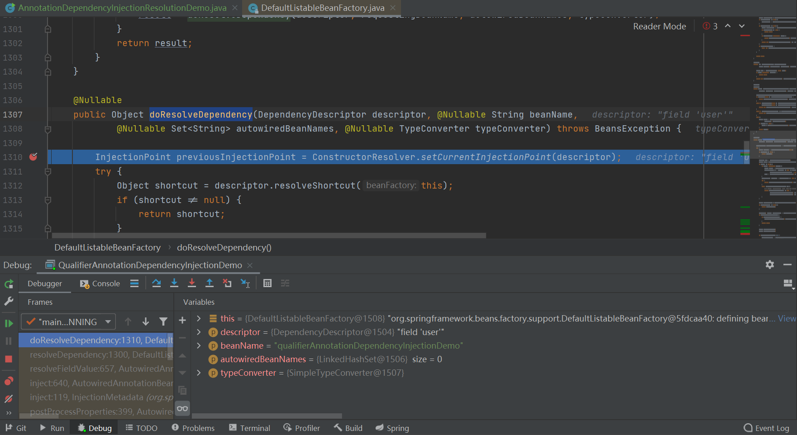
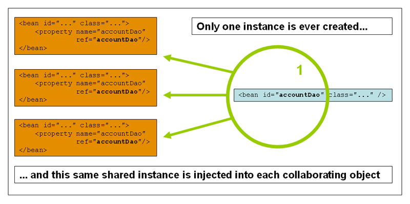
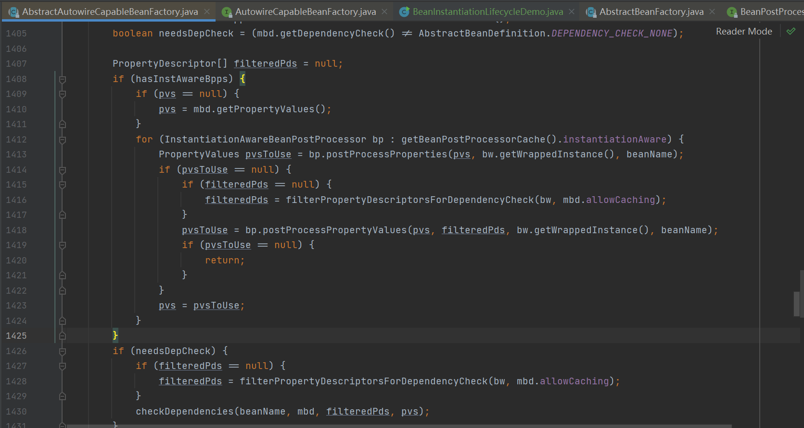

# Spring基础

## Spring特性总览

### Spring 中值得学习的地方

1. Java语言特性，例如反射、动态代理、枚举、泛型、注解、ARM、Lambda语法
2. 设计思想和模式的实现，如OOP，DDD，TDD，GoF23等
3. Java API的封装与简化，如JDBC，事务，Transaction，Servlet，JPA，JMX ，Bean Validation
4. JSR规范的适配与实现
5. 第三方框架的整合，如MyBatis整合Hibernetes和Redis

### Spring核心特性

1. IOC容器（IOC Container）
2. Spring事件（Events）
3. 资源管理（Resources）
4. 国际化（i18n）
5. 校验（Validation）
6. 数据绑定（Data Binding）
7. 类型转换（Type Conversion）
8. Spring表达式（Spring Express Language）
9. 面向切面编程（AOP）

### Spring数据存储

1. JDBC
2. 事务抽象（Transactions）
3. DAO支持（DAO Support）
4. O/R映射（O/R Mapping）
5. XML编列（XML Marshalling）

### Spring Web技术

1. Web Servlet技术栈
	1. Spring MVC
	2. WebSocket
	3. SockJS
2. Web Reactive技术栈
	1. Spring WebFlux
	2. WebClient
	3. WebSocket

### Spring技术整合

1. 远程调用（Remoting）
2. Java消息服务（JMS）
3. Java连接架构（JCA）
4. Java管理扩展（JMX）
5. Java邮件客户端（Email）
6. 本地任务（Taks）
7. 本地调度（Scheduling）
8. 缓存抽象（Caching）

### Spring测试

1. 模拟对象（Mock Objects）
2. TestContext框架（TestContext Framework）
3. Spring MVC测试（Spring MVC Test）
4. Web 测试客户端（Web TestClient）

## Spring版本特性

| Spring Framework版本 | Java标准版 | Java企业版       |
| -------------------- | ---------- | ---------------- |
| 1.x                  | 1.3+       | J2EE 1.3+        |
| 2.x                  | 1.4.2+     | J2EE 1.3+        |
| 3.x                  | 5+         | J2EE1.4和JavaEE5 |
| 4.x                  | 6+         | Java EE6和7      |
| 5.x                  | 8+         | Java EE7         |

## Spring模块化设计

[仓库链接](https://github.com/spring-projects/spring-framework)


## Spring编程模型

1. 面向对象编程

	1. 锲约接口：Aware、BeanPostProcessor...
	2. 设计模式：观察者模式、组合模式、模板模式...
	3. 对象继承：Abstract类

2. 面向切面编程

	1. 动态代理：JDKDynamicAopProxy
	2. 字节码提升：ASM、CGLib、AspectJ

3. 面向元编程

	1. 注解：模式注解（@Component、@Service、@Respository...）
	2. 配置：Environment抽象、PropertySources、BeanDefinition...
	3. 泛型：Generic TypeResolver、Resolvable Type...

4. 函数驱动

	1. 函数接口：ApplicationEventPublisher
	2. Reactive：Spring WebFlux

5. 模块驱动

	1. Maven Artifacts
	2. OSGI Bundies
	3. Java 9 Automatic Modules
	4. Spring @Enable*

	​                                                                                                                                                                                                                                                                                                                                                                                                                                                                                                                                                                                                                                                             

## Spring的核心价值

1. 生态系统
	1. Spring Boot
	2. Spring Cloud
	3. Spring Security
	4. Spring Data
	5. 其他
2. API抽象设计
	1. AOP抽象
	2. 事务抽象
	3. Environment抽象
	4. 生命周期
3. 编程模型
	1. 面向对象编程：契约接口
	2. 面向切面编程：动态代理、字节码提升
	3. 面向元编程：配置元信息、注解、配置
	4. 面向模块编程：Maven Artifacts、Java9 Automatic Modules
	5. Spring @Enable*注解
	6. 面向函数式编程：Lambda、Reactive
4. 设计思想
	1. Object-Oriented Programming（OOP）
	2. Ioc/DI
	3. Domain-Driven Development（DDD）
	4. Test-Driven Development（TDD）
	5. Event-Driven Programing（EDP）
	6. Functional Programing（FP）
5. 设计模式
	1. 专属模式
		1. 前缀模式：Enable模式
			1. Configurable模式
		2. 后缀模式
			1. 处理器模式（Process、Resolver、Handler）
			2. 意识模式（Aware）
			3. 配置器模式（Configuror）
			4. 选择器模式（ImportSelector）
	2. 传统GoF23
6. 用户基础
	1. Spring用户 Spring Framework、SpringBoot、Spring Cloud
	2. 传统用户 Java SE、Java EE

## 面试题

### 什么是Spring Framework？

 Spring Framework提供一个完整性的编程或配置的一个现代化的基于Java的企业的应用，Spring的核心特点是在应用级别上的基础设施建设。

Spring使得你的应用开发变的更容易，它可以提供任何你想要的东西，并是拥抱企业环境的Java语言，并且支持可以运行在JVM上面的其他语言，比如Groovy或者Kotlin，同时也提供一些弹性，根据软件的需要提供不同的软件架构。

### Spring Framwork有哪些核心模块？

1. Spring-core：Spring 基础API模块，如资源管理、泛型处理
2. Spring-beans：Spring Bean相关，如依赖查找，依赖注入
3. Spring-aop：Spring AOP处理，如动态代理，AOP字节码提升
4. Spring-context：事件驱动、注解驱动、模块驱动
5. Spring-expresson：Spring 表达式语言模块

### Spring Framework的优势和不足是什么？

待定...

# IoC简介

## IoC的发展简介

1. 1983年，好莱坞原则
2. 1988年，控制反转
3. 1996年，Inversion of control -> Hollywood principle
4. 2004年，Martin Fowler提出了自己对IoC以及DI的理解
5. 2005年，Martin Fowler对IoC做出了进一步的说明

## IoC主要实现策略

1. 使用service locator pattern（服务定位模式）
2. 通过依赖注入：
	1. 构造器注入
	2. 参数注入
	3. Setter注入
	4. 接口注入
3. 上下文的依赖查询（beancontext）
4. 模板方法设计模式（例如JDBC）
5. 策略模式

IoC主要的实现策略：依赖查找、依赖注入。

## IoC容器的职责

1. 依赖处理
	1. 依赖查找
	2. 依赖注入
2. 生命周期管理
	1. 容器
	2. 托管的资源（Java Beans或其他资源）
3. 配置
	1. 容器
	2. 外部化配置
	3. 托管的资源（Java Beans或其他资源）

## IoC的实现

1. Java SE
	- Java Beans
	- Java ServiceLoader SPI
	- JNDI（Java Naming and Directory Interface）
2. Java EE
	- EJB（Enterprise Java Beans）
	- Servlet
3. 开源
	- Apache Avalon
	- PicoContainer
	- Google Guice
	- Spring Framework

## 传统IoC容器的实现

Java Beans 作为IoC容器的特性：

- 依赖查找
- 生命周期管理
- 配置元信息
- 事件
- 自定义
- 资源管理
- 持久化

什么是Java Beans呢？

```java
/**
 * 描述人的POJO类
 */
public class Person {

    String name;

    Integer age;

    public String getName() {
        return name;
    }

    public void setName(String name) {
        this.name = name;
    }

    public Integer getAge() {
        return age;
    }

    public void setAge(Integer age) {
        this.age = age;
    }
}
```

我们可以打印这个Bean的元信息：

```java
public class BeanInfoDemo {
    public static void main(String[] args) throws Exception {
        BeanInfo beanInfo = Introspector.getBeanInfo(Person.class, Object.class);
        Stream.of(beanInfo.getPropertyDescriptors()).forEach(System.out::println);
    }
}
```

打印结果：

```txt
java.beans.PropertyDescriptor[name=age; propertyType=class java.lang.Integer; readMethod=public java.lang.Integer beans.Person.getAge(); writeMethod=public void beans.Person.setAge(java.lang.Integer)]
java.beans.PropertyDescriptor[name=name; propertyType=class java.lang.String; readMethod=public java.lang.String beans.Person.getName(); writeMethod=public void beans.Person.setName(java.lang.String)]
```

## 如何界定IoC容器是轻量级的？

以下观点出自于《J2EE Development without EJB》

1. 管理应用代码
2. 能够快速启动
3. 容器不需要一些特殊的配置来进行操作（主要是针对于EJB）
4. 容器的内存占用小以及最小化API的一个依赖
5. 容器需要一些可以管控的一个渠道，这个渠道能够帮助我们去部署和管理一些细粒度的对象，甚至是一些粗粒度的组件

## 依赖查找和依赖注入

| 类型     | 依赖处理 | 实现便利性 | 代码入侵性   | API依赖性         | 可读性 |
| -------- | -------- | ---------- | ------------ | ----------------- | ------ |
| 依赖查找 | 主动获取 | 相对繁琐   | 侵入业务逻辑 | 依赖容器API       | 良好   |
| 依赖注入 | 被动提供 | 相对便利   | 低入侵性     | 不主动依赖容器API | 一般   |

## 构造器注入和Setter注入

Spring官方推荐使用构造器注入，这样可以确保在注入时，对象不为空，但是参数过多时会影响代码的整洁性，可能需要考虑重构。

Setter注入应该主要仅用于我们的可选性的注入，因为Setter的字段本身是可以为空的。

而《J2EE Development without EJB》认为应该使用Setter注入，原因在于：

1. JavaBean属性能够获取更好的IDE支持
2. JavaBean属性通常是一个自文档的说明
3. 在类型转换上有优势
4. 大量的JavaBeans可能不经过任何修改就可以在JavaBean容器当中使用

当然，Setter注入也有缺点，就是无法确定属性初始化的顺序。

## 面试题

### 什么是IoC？

简单地说，IoC是反转控制，类似于好莱坞原则，主要有依赖查找和依赖注入两种实现。按照IoC的定义，很多方面其实都是IoC，比如JavaBeans是IoC的一个容器实现，Servlet的容器也是IoC的实现，因为Servlet可以去依赖或者反向地通过JNDI的方式进行得到一些外部的一些资源，包括DataSource或者相关的EJB的组件，于此同时SpringFramework或者Peak Container的依赖注入的框架，也能帮助我们去实现IoC，除此之外，消息也可以看作是IoC的一种实现。

### 依赖查找和依赖注入的区别？

依赖查找是主动或手动的依赖查找方式，通常需要依赖容器或标准API实现。而依赖注入则是手动或自动依赖绑定的方式，无需依赖特定的容器和API。

### Spring作为IoC容器有什么优势？

典型的IoC管理，依赖查找和依赖注入，AOP抽象，事务抽象，事件机制，SPI扩展，强大的第三方整合，易测试性，更好的面向对象。

# IoC实践

## Spring IoC依赖查找

1. 根据Bean名称查找
	- 实时查找
	- 延迟查找
2. 根据Bean类型查找
	- 单个Bean对象
	- 集合Bean对象
3. 根据Bean名称+类型查找
4. 根据Java注解查找

新建一个用户类：

```java
/**
 * 用户类
 */
public class User {
    private String id;

    private String name;

    public String getId() {
        return id;
    }

    public void setId(String id) {
        this.id = id;
    }

    public String getName() {
        return name;
    }

    public void setName(String name) {
        this.name = name;
    }

    @Override
    public String toString() {
        return "User{" +
                "id='" + id + '\'' +
                ", name='" + name + '\'' +
                '}';
    }
}
```

新建一个超级用户类：

```java
/**
 * 超级用户
 */
@Super
public class SuperUser extends User{

    private String address;

    public String getAddress() {
        return address;
    }

    @Override
    public String toString() {
        return "SuperUser{" +
                "address='" + address + '\'' +
                "} " + super.toString();
    }

    public void setAddress(String address) {
        this.address = address;
    }
}
```

新建一个注解：

```java
/**
 * 超级
 */
@Target(ElementType.TYPE)
@Retention(RetentionPolicy.RUNTIME)
public @interface Super {
}

```

向容器中注入一些Bean：

```xml
<?xml version="1.0" encoding="UTF-8"?>
<beans xmlns="http://www.springframework.org/schema/beans"
       xmlns:xsi="http://www.w3.org/2001/XMLSchema-instance"
       xsi:schemaLocation="http://www.springframework.org/schema/beans http://www.springframework.org/schema/beans/spring-beans.xsd">

    <bean id="user" class="org.jyc.thinking.in.spring.ioc.overview.dependency.domain.User">
        <property name="id" value="1"/>
        <property name="name" value="吉永超" />
    </bean>

    <bean id="SuperUser" class="org.jyc.thinking.in.spring.ioc.overview.dependency.domain.SuperUser" parent="user" primary="true">
        <property name="address" value="深圳" />
    </bean>

    <bean id="objectFactory" class="org.springframework.beans.factory.config.ObjectFactoryCreatingFactoryBean">
        <property name="targetBeanName" value="user"></property>
    </bean>
</beans>
```

依赖查找的示例：

```java
public class DependencyLookupDemo {
    public static void main(String[] args) {
        // 配置XML文件
        // 启动Spring应用上下文
        BeanFactory beanFactory = new ClassPathXmlApplicationContext("META-INF/dependency-lookup-context.xml");
        // 实时查找
        lookupInRealTime(beanFactory);
        // 延迟查找
        lookupInLazy(beanFactory);
        // 按照类型查找
        lookupByType(beanFactory);
        // 按照类型查找集合对象
        lookupCollectionType(beanFactory);
        // 通过注解查找
        lookupByAnnotationType(beanFactory);
    }

    /**
     * 通过注解查找
     * @param beanFactory
     */
    private static void lookupByAnnotationType(BeanFactory beanFactory) {
        if (beanFactory instanceof ListableBeanFactory) {
            ListableBeanFactory listableBeanFactory = (ListableBeanFactory) beanFactory;
            Map<String, User> users = (Map)listableBeanFactory.getBeansWithAnnotation(Super.class);
            System.out.println("查找到的所有标注@Super的User集合对象：" + users);
        }
    }

    /**
     * 按照类型查找集合对象
     * @param beanFactory
     */
    private static void lookupCollectionType(BeanFactory beanFactory) {
        if (beanFactory instanceof ListableBeanFactory) {
            ListableBeanFactory listableBeanFactory = (ListableBeanFactory) beanFactory;
            Map<String, User> users = listableBeanFactory.getBeansOfType(User.class);
            System.out.println("查找到的所有的User集合对象：" + users);
        }
    }

    /**
     * 按照类型查找
     * @param beanFactory
     */
    private static void lookupByType(BeanFactory beanFactory) {
        User user = beanFactory.getBean(User.class);
        System.out.println("按照类型查找 " + user);

    }

    /**
     * 延迟查找
     *
     * @param beanFactory
     */
    private static void lookupInLazy(BeanFactory beanFactory) {
        ObjectFactory<User> objectFactory = (ObjectFactory<User>) beanFactory.getBean("objectFactory");
        User user = objectFactory.getObject();
        System.out.println("延迟查找 " + user);
    }

    /**
     * 实时查找
     *
     * @param beanFactory
     */
    private static void lookupInRealTime(BeanFactory beanFactory) {
        User user = (User) beanFactory.getBean("user");
        System.out.println("实时查找" + user);
    }
}
```

## Spring IoC依赖注入

1. 根据Bean名称注入
2. 根据Bean类型注入
	- 单个Bean对象
	- 集合Bean对象
3. 注入容器内建的Bean对象
4. 注入非Bean对象
5. 注入类型
	- 实时注入
	- 延迟注入

```java
/**
 * 用户信息仓库
 */
public class UserRespository {

    private Collection<User> users; // 自定义Bean

    private BeanFactory beanFactory; //内建的非Bean对象（对象）

    private ObjectFactory<ApplicationContext> objectFactory;

    public Collection<User> getUsers() {
        return users;
    }

    public void setUsers(Collection<User> users) {
        this.users = users;
    }

    public void setBeanFactory(BeanFactory beanFactory) {
        this.beanFactory = beanFactory;
    }

    public ObjectFactory<ApplicationContext> getObjectFactory() {
        return objectFactory;
    }

    public void setObjectFactory(ObjectFactory<ApplicationContext> objectFactory) {
        this.objectFactory = objectFactory;
    }

    public BeanFactory getBeanFactory() {
        return beanFactory;
    }
}
```

定义一个类似的资源：

```xml
<?xml version="1.0" encoding="UTF-8"?>
<beans xmlns="http://www.springframework.org/schema/beans"
       xmlns:xsi="http://www.w3.org/2001/XMLSchema-instance"
       xmlns:util="http://www.springframework.org/schema/util"
       xsi:schemaLocation="http://www.springframework.org/schema/beans http://www.springframework.org/schema/beans/spring-beans.xsd">

    <!-- 通过导入复用   -->
    <import resource="dependency-lookup-context.xml" />

    <!--   Auto-wiring     -->
    <bean id="userRespository" class="org.jyc.thinking.in.spring.ioc.overview.dependency.repository.UserRespository" autowire="byType">
        <!--   手动配置     -->
<!--        <property name="users">-->
<!--            <util:list>-->
<!--                <ref bean="user"></ref>-->
<!--                <ref bean="SuperUser"></ref>-->
<!--            </util:list>-->
<!--        </property>-->
    </bean>
</beans>
```

测试：

```java
public class DependencyInjectionDemo {
    public static void main(String[] args) {
        // 配置XML文件
        // 启动Spring应用上下文
        BeanFactory beanFactory = new ClassPathXmlApplicationContext("META-INF/dependency-injection-context.xml");

        UserRespository userRespository = beanFactory.getBean("userRespository", UserRespository.class);
//        System.out.println(userRespository.getUsers());
        System.out.println(userRespository.getBeanFactory());
//        System.out.println(userRespository.getBeanFactory() == beanFactory);
        ObjectFactory<ApplicationContext> userFactory = userRespository.getObjectFactory();
        System.out.println(userFactory.getObject() == beanFactory);

    }
}
```

对比结果可以发现依赖查找和依赖注入的来源并不一样。

## Spring依赖注入和依赖查找的来源

1. 自定义Bean
2. 容器内建Bean对象
3. 容器内建依赖

```java
public class DependencyInjectionDemo {
    public static void main(String[] args) {
        // 配置XML文件
        // 启动Spring应用上下文
        BeanFactory beanFactory = new ClassPathXmlApplicationContext("META-INF/dependency-injection-context.xml");
        // 自定义的Bean
        UserRespository userRespository = beanFactory.getBean("userRespository", UserRespository.class);
        // 依赖注入（内建依赖）
        System.out.println(userRespository.getBeanFactory());
        // 容器内建Bean对象
        Environment environment = beanFactory.getBean(Environment.class);

        System.out.println("获取Enviroment类型的Bean" + environment);

    }
}
```

## Spring IoC配置元信息

1. Bean定义配置
	- 基于XML文件
	- 基于Properties文件
	- 基于Java注解
	- 基于Java API（专题讨论）
2. IoC容器配置
	- 基于XML文件
	- 基于Java注解
	- 基于Java API（专题讨论）
3. 外部化属性配置
	- 基于Java注解

## BeanFactory和ApplicationContext

BeanFactory和ApplicationContext谁才是Spring IoC容器？

BeanFactory是一个具有基本功能的框架，而ApplicationContext添加了更多企业级的特性，总而言之，ApplicationContext是BeanFactory的超集，并且在实现上，ApplicationContext虽然继承了BeanFactory接口，但内部的BeanFactory是采用组合的方式进行的实现，默认的实现类为DefaultListableBeanFactory。

ApplicationContext除了IoC容器角色，还有提供：

- 面向切面（AOP）
- 配置元信息（Configuration Metadata）
- 资源管理（Resources）
- 事件（Events）
- 国际化（i18n）
- 注解（Annotations）
- Environment抽象（Environment Abstraction）

BeanFactory的IoC容器的使用：

```java
/**
 * BeanFactory作为IoC容器示例
 */
public class BeanFactoryAsIoCContainerDemo {
    public static void main(String[] args) {
        // 创建BeanFactory容器
        DefaultListableBeanFactory beanFactory = new DefaultListableBeanFactory();
        // 加载配置
        XmlBeanDefinitionReader reader = new XmlBeanDefinitionReader(beanFactory);
        // XML配置文件ClassPath路径
        String location = "classpath:/META-INF/dependency-lookup-context.xml";
        // 加载配置
        int beanDefinitions = reader.loadBeanDefinitions(location);
        System.out.println("Bean定义加载的数量: " + beanDefinitions);
        // 依赖查找集合对象....
        lookupCollectionType(beanFactory);
    }

    /**
     * 按照类型查找集合对象
     * @param beanFactory
     */
    private static void lookupCollectionType(BeanFactory beanFactory) {
        if (beanFactory instanceof ListableBeanFactory) {
            ListableBeanFactory listableBeanFactory = (ListableBeanFactory) beanFactory;
            Map<String, User> users = listableBeanFactory.getBeansOfType(User.class);
            System.out.println("查找到的所有的User集合对象：" + users);
        }
    }
}
```

Application的IoC容器使用：

 ```java
/**
 * ApplicationA作为IoC容器示例
 */
public class AnnotationApplicationAsIoCContainerDemo {
    public static void main(String[] args) {
        // 创建BeanFactory容器
        AnnotationConfigApplicationContext applicationContext = new AnnotationConfigApplicationContext();
        applicationContext.register(AnnotationApplicationAsIoCContainerDemo.class);
        applicationContext.refresh();
        // 依赖查找集合对象....
        lookupCollectionType(applicationContext);
    }

    @Bean
    public User user() {
        User user = new User();
        user.setId("1");
        user.setName("吉永超");
        return user;
    }

    /**
     * 按照类型查找集合对象
     * @param beanFactory
     */
    private static void lookupCollectionType(BeanFactory beanFactory) {
        if (beanFactory instanceof ListableBeanFactory) {
            ListableBeanFactory listableBeanFactory = (ListableBeanFactory) beanFactory;
            Map<String, User> users = listableBeanFactory.getBeansOfType(User.class);
            System.out.println("查找到的所有的User集合对象：" + users);
        }
    }
}
 ```

可以看到，使用BeanFactory和ApplicationContext都可以完成依赖查找的功能。

## Spring IoC容器生命周期

```java
	public void refresh() throws BeansException, IllegalStateException {
		synchronized (this.startupShutdownMonitor) {
			StartupStep contextRefresh = this.applicationStartup.start("spring.context.refresh");

			// Prepare this context for refreshing.
			prepareRefresh();

			// Tell the subclass to refresh the internal bean factory.
			ConfigurableListableBeanFactory beanFactory = obtainFreshBeanFactory();

			// Prepare the bean factory for use in this context.
			prepareBeanFactory(beanFactory);

			try {
				// Allows post-processing of the bean factory in context subclasses.
				postProcessBeanFactory(beanFactory);

				StartupStep beanPostProcess = this.applicationStartup.start("spring.context.beans.post-process");
				// Invoke factory processors registered as beans in the context.
				invokeBeanFactoryPostProcessors(beanFactory);

				// Register bean processors that intercept bean creation.
				registerBeanPostProcessors(beanFactory);
				beanPostProcess.end();

				// Initialize message source for this context.
				initMessageSource();

				// Initialize event multicaster for this context.
				initApplicationEventMulticaster();

				// Initialize other special beans in specific context subclasses.
				onRefresh();

				// Check for listener beans and register them.
				registerListeners();

				// Instantiate all remaining (non-lazy-init) singletons.
				finishBeanFactoryInitialization(beanFactory);

				// Last step: publish corresponding event.
				finishRefresh();
			}

			catch (BeansException ex) {
				if (logger.isWarnEnabled()) {
					logger.warn("Exception encountered during context initialization - " +
							"cancelling refresh attempt: " + ex);
				}

				// Destroy already created singletons to avoid dangling resources.
				destroyBeans();

				// Reset 'active' flag.
				cancelRefresh(ex);

				// Propagate exception to caller.
				throw ex;
			}

			finally {
				// Reset common introspection caches in Spring's core, since we
				// might not ever need metadata for singleton beans anymore...
				resetCommonCaches();
				contextRefresh.end();
			}
		}
	}
```

## 面试题

### 什么是Spring IoC容器

Spring Framework是IoC（控制反转）的一种具体的实现，主要包括了DI（dependency injection），和DL（dependency lookup）。

### BeanFactory和FactoryBean

BeanFactory是IoC底层容器，FactoryBean是创建Bean的一种方式，帮助实现复杂的初始化逻辑。

### Spring IoC容器启动时做了哪些准备？

IoC配置元信息读取和解析、IoC容器生命周期、Spring事件发布、国际化等。

# Spring Bean基础

## BeanDefinition

BeanDefinition时Spring Framework中定义Bean配置元信息接口，包含：

1. Bean的类名（必须是全限定类名）
2. Bean行为配置元素，如作用域、自动绑定的模式、生命周期回调等
3. 其他Bean引用，又可称合作者（collaborators）或者依赖（dependencies）
4. 配置设置，比如Bean属性（Properties）

BeanDefinition元信息

| 属性（Property）         | 说明                                         |
| ------------------------ | -------------------------------------------- |
| Class                    | Bean全类名，必须是具体类，不能用抽象类或接口 |
| Name                     | Bean的名称或者ID                             |
| Scope                    | Bean的作用域（如：singleton、prototype等）   |
| Constructor arguments    | Bean构造器参数（用于依赖注入）               |
| Properties               | Bean属性设置（用于依赖注入）                 |
| Autowiring mode          | Bean自动绑定模式（如：通过名称byName）       |
| Lazy initialization mode | Bean延迟初始化模式（延迟和非延迟）           |
| Initialization method    | Bean初始化回调方法名称                       |
| Destruction method       | Bean销毁回调方法名称                         |

BeanDefinition的构建方式

1. 通过BeanDefinitionBuilder
2. 通过AbstactBeanDefinition以及派生类

```java
/**
 * BeanDefinition构建示例
 */
public class BeanDefinitionCreationDemo {
    public static void main(String[] args) {
        // 1.通过BeanDefinitionBuilder
        BeanDefinitionBuilder beanDefinitionBuilder = BeanDefinitionBuilder.genericBeanDefinition(User.class);
        // 通过属性设置
        beanDefinitionBuilder.addPropertyValue("name","jyc");
        beanDefinitionBuilder.addPropertyValue("age","1");
        // 获取BeanDefinition实例
        AbstractBeanDefinition beanDefinition = beanDefinitionBuilder.getBeanDefinition();
        // BeanDefinition并非Bean的终态，可以自定义修改

        // 2.通过AbstactBeanDefinition以及派生类
        GenericBeanDefinition genericBeanDefinition = new GenericBeanDefinition();
        // 设置Bean类型
        genericBeanDefinition.setBeanClass(User.class);
        // 通过MutablePropertyValues批量操作属性
        MutablePropertyValues propertyValues = new MutablePropertyValues();
        propertyValues.addPropertyValue("id","1");
        propertyValues.addPropertyValue("name","jyc");
        genericBeanDefinition.setPropertyValues(propertyValues);
    }
}
```

## Spring Bean命名

什么是Bean的名称？

每个Bean拥有一个或多个标识符（identifiers），这些标识符在Bean所在的容器必须是唯一的。通常，一个Bean仅有一个标识符，如果需要额外的，可考虑使用别名（Alias）来扩充。

在基于XML的配置元信息中，开发人员可用id或者name属性来规定Bean的标识符。通常Bean的标识符由字母组成，允许出现特殊字符，如果要想映入新的Bean的别名的话，可在name属性使用半角逗号（“,”）或分号（“;”）来间隔。

Bean的id或name属性并非必须制定，如果留空的话，容器回味Bean自动生成一个唯一的名称。Bean的名称尽管没有限制，不过官方建议采用驼峰的方式，更符合Java的命名约定。

Bean名称生成器（BeanNameGenerator）主要有两种实现：

1. DefaultBeanNameGenerator（默认通用BeanNameGenerator实现）
2. AnnotationBeanNameGenerator

默认实现的核心代码：

```java
	public static String generateBeanName(
			BeanDefinition definition, BeanDefinitionRegistry registry, boolean isInnerBean)
			throws BeanDefinitionStoreException {

		String generatedBeanName = definition.getBeanClassName();
		if (generatedBeanName == null) {
			if (definition.getParentName() != null) {
				generatedBeanName = definition.getParentName() + "$child";
			}
			else if (definition.getFactoryBeanName() != null) {
				generatedBeanName = definition.getFactoryBeanName() + "$created";
			}
		}
		if (!StringUtils.hasText(generatedBeanName)) {
			throw new BeanDefinitionStoreException("Unnamed bean definition specifies neither " +
					"'class' nor 'parent' nor 'factory-bean' - can't generate bean name");
		}

		if (isInnerBean) {
			// Inner bean: generate identity hashcode suffix.
			return generatedBeanName + GENERATED_BEAN_NAME_SEPARATOR + ObjectUtils.getIdentityHexString(definition);
		}

		// Top-level bean: use plain class name with unique suffix if necessary.
		return uniqueBeanName(generatedBeanName, registry);
	}
```

如果是简单场景的Bean的名称：

```java
	public static String uniqueBeanName(String beanName, BeanDefinitionRegistry registry) {
		String id = beanName;
		int counter = -1;

		// Increase counter until the id is unique.
		String prefix = beanName + GENERATED_BEAN_NAME_SEPARATOR;
		while (counter == -1 || registry.containsBeanDefinition(id)) {
			counter++;
			id = prefix + counter;
		}
		return id;
	}
```

注解实现的核心源代码：

```java
@Override
	public String generateBeanName(BeanDefinition definition, BeanDefinitionRegistry registry) {
		if (definition instanceof AnnotatedBeanDefinition) {
			String beanName = determineBeanNameFromAnnotation((AnnotatedBeanDefinition) definition);
			if (StringUtils.hasText(beanName)) {
				// Explicit bean name found.
				return beanName;
			}
		}
		// Fallback: generate a unique default bean name.
		return buildDefaultBeanName(definition, registry);
	}
```

如果是一个普通的Bean就会调用Java Beans的API：

```java
	protected String buildDefaultBeanName(BeanDefinition definition) {
		String beanClassName = definition.getBeanClassName();
		Assert.state(beanClassName != null, "No bean class name set");
		String shortClassName = ClassUtils.getShortName(beanClassName);
		return Introspector.decapitalize(shortClassName);
	}
```

Bean别名（Alias）的价值：

1. 复用现有的BeanDefinition

2. 更具有场景化的命名方法，比如：

	```xml
	<alias name="myApp-dataSource" alias="subsystemA-datasource" />
	<alias name="myApp-dataSource" alias="subsystemB-datasource" />
	```

## BeanDefinition注册到IoC容器

BeanDefinition注册的不同方式：

1. XML配置元信息
	- <bean name ="..." ... />
2. Java注解配置元信息
	- @Bean
	- @Component
	- @import
3. Java API配置元信息
	- 命名方式：BeanDefinitionRegistry#registerBeanDefinition（String，BeanDefinition）
	- 非命名方式：BeanDefinitionReaderUtils#registerWithGeneratedName(AbstractBeanDefinition，BeanDefinitionRegistry)
	- 配置类方式：AnnotatedBeanDefinitionReader#register（Class）

通过Java注解配置元信息：

```java
/**
 * 注解BeanDefinition示例
 */
@Import(AnnotationBeanDefinitionDemo.Config.class) // 3.通过@Import方式导入
public class AnnotationBeanDefinitionDemo {

    public static void main(String[] args) {
        AnnotationConfigApplicationContext applicationContext = new AnnotationConfigApplicationContext();
        // 注册配置类（configuration class）
        applicationContext.register(AnnotationBeanDefinitionDemo.class);
        applicationContext.refresh();
        System.out.println("Config类型的所有的Beans" + applicationContext.getBeansOfType(Config.class));
        System.out.println("user类型的所有的Beans" + applicationContext.getBeansOfType(User.class));
        applicationContext.close();
    }

    // 2.通过Component方式
    @Component //定义当前类作为Spring Bean（组件）
    public static class Config {
        // 1.通过@Bean方式定义
        @Bean({"user", "jyc"})
        public User user() {
            User user = new User();
            user.setId("1");
            user.setName("吉永超");
            return user;
        }
    }
}
```

Java API配置元信息：

```java
/**
     * 命名Bean的注册方式
     *  @param registry
     * @param beanName
     */
    public static void registerUserBeanDefinition(BeanDefinitionRegistry registry, String beanName) {
        BeanDefinitionBuilder beanDefinitionBuilder = BeanDefinitionBuilder.genericBeanDefinition(User.class);
        beanDefinitionBuilder.addPropertyValue("id", "1").addPropertyValue("name", "jiyongchao");
        // 判断如果beanName参数存在时
        if (StringUtils.hasText(beanName)) {
            registry.registerBeanDefinition(beanName, beanDefinitionBuilder.getBeanDefinition());
        } else {
            // 非命名的Bean注册方法
            BeanDefinitionReaderUtils.registerWithGeneratedName(beanDefinitionBuilder.getBeanDefinition(), registry);
        }
    }
```

## 实例化Bean的方式

Bean实例化：

1. 常规方式

	- 通过构造器（配置元信息：XML、Java注解和Java API）
	- 通过静态工厂方法（配置元信息：XML和Java API）
	- 通过Bean工厂方法（配置元信息：XML和Java API）
	- 通过FactoryBean（配置元信息：XML、Java注解和Java API）

2. 特殊方式

	- 通过ServiceLoaderFactoryBean（配置元信息：XML、Java注解和Java API）
	- 通过AutowireCapableBeanFactory#createBean（java.lang.Class，int，boolean）
	- 通过BeanDefinitionResgistry#registerBeanDefinition（String，BeanDefinition）

	常规方式实例化的示例：

	```xml
	<beans xmlns="http://www.springframework.org/schema/beans"
	       xmlns:xsi="http://www.w3.org/2001/XMLSchema-instance"
	       xsi:schemaLocation="http://www.springframework.org/schema/beans http://www.springframework.org/schema/beans/spring-beans.xsd">
	
	    <!--  静态方法实例化Bean  -->
	    <bean id="user-by-static-method" class="org.jyc.thinking.in.spring.ioc.overview.dependency.domain.User" factory-method="createUser" />
	    <!--  实例方法实例化Bean  -->
	    <bean id="user-by-instance-method" factory-bean="userFactory" factory-method="createUser"/>
	    <!--  Bean工厂实例化Bean  -->
	    <bean id="userFactory" class="org.jyc.thinking.in.spring.bean.definition.factory.DefaultUserFactory" />
	    <!--  FactoryBean实例化Bean  -->
	    <bean id="user-by-factory-bean" class="org.jyc.thinking.in.spring.bean.definition.factory.UserFactoryBean"/>
	</beans>
	```

	其中UserFactoryBean为：

	```java
	/**
	 * User Bean的FactoryBean的实现
	 */
	public class UserFactoryBean implements FactoryBean {
	    @Override
	    public Object getObject() throws Exception {
	        return new User();
	    }
	
	    @Override
	    public Class<?> getObjectType() {
	        return null;
	    }
	}
	```

	测试输出：

	```java
	/**
	 * Bean实例化示例
	 */
	public class BeanInstantiationDemo {
	    public static void main(String[] args) {
	        BeanFactory beanFactory = new ClassPathXmlApplicationContext("classpath:/META-INF/bean-instantiation-context.xml");
	        User user = beanFactory.getBean("user-by-static-method", User.class);
	        User userByInstanceMethod = beanFactory.getBean("user-by-instance-method", User.class);
	        User userByFactoryBean = beanFactory.getBean("user-by-instance-method", User.class);
	        System.out.println(user);
	        System.out.println(userByInstanceMethod);
	        System.out.println(userByFactoryBean);
	
	        System.out.println(user == userByInstanceMethod);
	        System.out.println(user == userByFactoryBean);
	    }
	}
	```

	特殊方式的示例：

	```xml
	<?xml version="1.0" encoding="UTF-8"?>
	<beans xmlns="http://www.springframework.org/schema/beans"
	       xmlns:xsi="http://www.w3.org/2001/XMLSchema-instance"
	       xsi:schemaLocation="http://www.springframework.org/schema/beans http://www.springframework.org/schema/beans/spring-beans.xsd">
	
	    <bean id="userFactoryServiceLoader" class="org.springframework.beans.factory.serviceloader.ServiceLoaderFactoryBean" >
	        <property name="serviceType" value="org.jyc.thinking.in.spring.bean.definition.factory.UserFactory" />
	    </bean>
	</beans>
	```

	测试输出：

	```java
	public class SpecialBeanInstantiationDemo {
	    public static void main(String[] args) {
	        BeanFactory beanFactory = new ClassPathXmlApplicationContext("classpath:/META-INF/special-bean-instantiation-context.xml");
	        ServiceLoader serviceLoader = beanFactory.getBean("userFactoryServiceLoader", ServiceLoader.class);
	        displayServiceLoader(serviceLoader);
	        demoServiceLoader();
	    }
	    public static void demoServiceLoader() {
	        ServiceLoader<UserFactory> serviceLoader = ServiceLoader.load(UserFactory.class, Thread.currentThread().getContextClassLoader());
	        displayServiceLoader(serviceLoader);
	    }
	
	    private static void displayServiceLoader(ServiceLoader<UserFactory> serviceLoader) {
	        Iterator<UserFactory> iterator = serviceLoader.iterator();
	        while (iterator.hasNext()) {
	            UserFactory userFactory = iterator.next();
	            System.out.println(userFactory.createUser());
	        }
	    }
	}
	```

	通过AutowireCapableBeanFactory实例化：

	```java
	   public static void main(String[] args) {
	        ApplicationContext applicationContext = new ClassPathXmlApplicationContext("classpath:/META-INF/special-bean-instantiation-context.xml");
	        // 通过ApplicationContext获取AutowireCapableBeanFactory
	        AutowireCapableBeanFactory beanFactory = applicationContext.getAutowireCapableBeanFactory();
	        // 通过AutowireCapableBeanFactory创建UserFactory对象
	        UserFactory userFactory = beanFactory.createBean(DefaultUserFactory.class);
	        System.out.println(userFactory.createUser());
	    }
	```

	## 初始化Bean的方式

	

	Bean的初始化（Initialization）：

	1. @PostConstruct标注方法
	2. 实现InitializingBean接口的afterPropertiesSet()方法
	3. 自定义初始化方法
		- XML配置：<bean init-method="init" ... />
		- Java注解：@Bean(initMethod="init")
		- Java API：AbstractBeanDefinition#setInitMethodName(String)


初始化的示例：

```java
public class DefaultUserFactory implements UserFactory, InitializingBean {
    // 1.基于@PostConstruct注解
    @PostConstruct
    public void init() {
        System.out.println("@PostConstruct: UserFactory 初始化中....");
    }

    @Override
    public void afterPropertiesSet() throws Exception {
        System.out.println("afterPropertiesSet: UserFactory 初始化中....");
    }

    public void initUserFactory() {
        System.out.println("自定义初始化方法： initUserFactory： UserFactory 初始化中....");
    }
}
```

调用的结果：

```java
@Configuration
public class BeanInitializationDemo {
    public static void main(String[] args) {
        AnnotationConfigApplicationContext applicationContext = new AnnotationConfigApplicationContext();
        applicationContext.register(BeanInitializationDemo.class);
        applicationContext.refresh();
        UserFactory userFactory = applicationContext.getBean(UserFactory.class);
        applicationContext.close();

    }

    @Bean(initMethod = "initUserFactory")
    public UserFactory userFactory() {
        return new DefaultUserFactory();
    }
}
```

最终实际上都会调用的AbstractBeanDefinition的setInitMethodName

```java
	public void setInitMethodName(@Nullable String initMethodName) {
		this.initMethodName = initMethodName;
	}
```

三者的执行顺序：

```java
@PostConstruct: UserFactory 初始化中....
afterPropertiesSet: UserFactory 初始化中....
自定义初始化方法： initUserFactory： UserFactory 初始化中....
```

## 延迟初始化Bean

Bean延迟初始化（Lazy Initialization）

1. XML配置：<bean lazy-init="true" .../>
2. Java注解：@Lazy(true)

Spring容器返回的对象和非延迟的对象存在怎样的差异？

非延迟初始化在Spring应用上下文启动完成后，被初始化。而延迟初始化是在依赖查找和依赖注入的时候才会进行初始化。

## 销毁Bean

Bean销毁（Destroy）

1. @PreDestory标注方法
2. 实现DisposableBean接口的destory()方法
3. 自定义销毁方法
	- XML配置：<bean destory="destory" .../>
	- Java注解：@Bean(destory="destory")
	- Java API: AbstractBeanDefinition#setDestoryMethodName(String)

销毁的示例：

```java
public class DefaultUserFactory implements UserFactory, DisposableBean {

    @PreDestroy
    public void preDestory() {
        System.out.println("@PreDestroy: UserFactory 销毁中....");
    }

    @Override
    public void destroy() throws Exception {
        System.out.println("DisposableBean#destroy: UserFactory 销毁中....");
    }

    public void doDestory() {
        System.out.println("自定义销毁方法：doDestory()： UserFactory 销毁中....");
    }
}
```

调用的结果：

```java
public class BeanDestoryDemo {
    public static void main(String[] args) {
        AnnotationConfigApplicationContext applicationContext = new AnnotationConfigApplicationContext();
        applicationContext.register(BeanDestoryDemo.class);
        applicationContext.refresh();
        // 非延迟初始化在Spring应用上下文启动完成后，被初始化。
        System.out.println("应用上下文已启动...");
        UserFactory userFactory = applicationContext.getBean(UserFactory.class);
        System.out.println(userFactory);
        System.out.println("应用上下文准备关闭...");
        applicationContext.close();
        System.out.println("应用上下文已关闭...");
    }

    @Bean(destroyMethod = "doDestory")
    public UserFactory userFactory() {
        return new DefaultUserFactory();
    }
}

```

通过不同时机的打印，可以观察到Bean的销毁的时机就是在应用上下文关闭的时候。

三者不同方式的执行结果：

```java
应用上下文已启动...
应用上下文准备关闭...
@PreDestroy: UserFactory 销毁中....
DisposableBean#destroy: UserFactory 销毁中....
自定义销毁方法：doDestory()： UserFactory 销毁中....
应用上下文已关闭...
```

## 垃圾回收Spring Bean

Bean垃圾回收（GC）

1. 关闭Spring容器（应用上下文）
2. 执行GC
3. Spring Bean覆盖的finalize()方法被回调

```java
/**
 * Bena垃圾回收的示例
 */
public class BeanGarbageCollectionDemo {
    public static void main(String[] args) {
        AnnotationConfigApplicationContext applicationContext = new AnnotationConfigApplicationContext();
        applicationContext.register(BeanInitializationDemo.class);
        applicationContext.refresh();
        applicationContext.close();
        System.out.println("Spring 应用上下文已关闭");
        // 强制触发GC
        System.gc();
    }
}
```

这里我们重写了DefaultUserFactory中的finalize()方法：

```java
    @Override
    protected void finalize() throws Throwable {
        System.out.println("当前DefaultUserFactory 对象正在被垃圾回收");
    }
```

## 面试题

### 如何注册一个Spring Bean？

通过BeanDefinition和外部单体对象来注册。

```java
/**
 * 单体Bean注册示例
 */
public class SingletonBeanRegistrationDemo {
    public static void main(String[] args) {
        AnnotationConfigApplicationContext applicationContext = new AnnotationConfigApplicationContext();
        // 注册外部单例对象
        UserFactory userFactory = new DefaultUserFactory();
        // 创建一个外部UserFactory对象
        ConfigurableListableBeanFactory beanFactory = applicationContext.getBeanFactory();
        // 注册外部单例对象
        beanFactory.registerSingleton("userFactory", userFactory);
        applicationContext.refresh();
        UserFactory userFactoryByLookup = beanFactory.getBean("userFactory", UserFactory.class);
        System.out.println("userFactory == userFactoryByLookup: " + (userFactory == userFactoryByLookup));
        applicationContext.close();
    }
}
```

### 什么是Spring BeanDefinition？

BeanDefinition是关于Bean定义的元信息的接口，允许我们通过getter、setter方法方式来进行存储信息。

### Spring容器是怎样管理注册Bean

如IoC配置元信息读取和解析、依赖查找和注入以及Bean生命周期等。

# 依赖查找

## 依赖查找简介

1. 单一类型依赖查找
	- JNDI - javax.naming.Context#lookup(javax.naming.Name)
	- JavaBeans - java.beans.beancontext.BeanContext
2. 集合类型依赖查找
	- java.beans.beancontext.BeanContext
3. 层次性依赖查找
	- java.beans.beancontext.BeanContext

## 单一类型依赖查找


单一类型依赖查找接口-BeanFactory

1. 根据Bean名称查找
	- getBean(String)
	- Spring 2.5 覆盖默认参数：getBean(String,Object...)
2. 根据Bean类型查找
	- Bean实时查找
		- Spring 3.0 getBean(Class)
		- Spring 4.1 覆盖默认参数：getBean(Class,Object...)
	- Spring 5.1 Bean延迟查找
		- getBeanProvider(Class)
		- getBeanProvider(ResolvableType)
3. 根据Bean名称 + 类型查找：getBean(String,Class) 

利用ObejctProvider进行依赖查找：

```java
/**
 * 通过ObjectProvider进行依赖查找
 */
public class ObejctProviderDemo { // @Configuration是非必须的注解
    public static void main(String[] args) {
        AnnotationConfigApplicationContext applicationContext = new AnnotationConfigApplicationContext();
        applicationContext.register(ObejctProviderDemo.class);
        applicationContext.refresh();
        lookupByObejctProvider(applicationContext);
        applicationContext.close();
    }

    @Bean
    public String helloworld() { // 方法名就是Bean名称 = “helloworld”
        return "helloworld";
    }

    private static void lookupByObejctProvider(AnnotationConfigApplicationContext applicationContext) {
        ObjectProvider<String> beanProvider = applicationContext.getBeanProvider(String.class);
        System.out.println(beanProvider.getObject());
    }
}
```

## 集合类型依赖查找

集合类型依赖查找接口-ListableBeanFactory

1. 根据Bean类型查找
	- 根据同类型Bean名称列表
		- getBeanNamesForType（Class）
		- Spring 4.2 getBeanNamesForType（ResolvableType）
	- 获取同类型Bean实例列表
		- getBeanOfType（Class）以及重载方法
2. 通过注解类型查找
	- Spring 3.0 获取标注类型Bean名称列表
		- getBeanNamesForAnnotation（Class<? extends Annotation>）
	- Spring 3.0 获取标注类型Bean实例列表
		- getBeansWithAnnotation（Class<? extends Annotation>）
	- Spring 3.0 获取指定名称 + 标注类型Bean 实例

相关的示例实际上在之前就已经提到过了：

```java
  /**
     * 通过注解查找
     * @param beanFactory
     */
    private static void lookupByAnnotationType(BeanFactory beanFactory) {
        if (beanFactory instanceof ListableBeanFactory) {
            ListableBeanFactory listableBeanFactory = (ListableBeanFactory) beanFactory;
            Map<String, User> users = (Map)listableBeanFactory.getBeansWithAnnotation(Super.class);
            System.out.println("查找到的所有标注@Super的User集合对象：" + users);
        }
    }

    /**
     * 按照类型查找集合对象
     * @param beanFactory
     */
    private static void lookupCollectionType(BeanFactory beanFactory) {
        if (beanFactory instanceof ListableBeanFactory) {
            ListableBeanFactory listableBeanFactory = (ListableBeanFactory) beanFactory;
            Map<String, User> users = listableBeanFactory.getBeansOfType(User.class);
            System.out.println("查找到的所有的User集合对象：" + users);
        }
    }
```

## 层次性依赖查找

层次性依赖查找接口-HierachicalBeanFactory

1. 双亲BeanFactory：getParentBeanFacotry
2. 层次性查找：
	- 根据Bean名称查找
		- 基于containsLocalBean方法实现
	- 根据Bean类型查找实例列表
		- 单一类型：BeanFactoryUtils#beanOfType
		- 集合类型BeanFactoryUtils#beanOfTypeIncludingAncestors
	- 根据Java注解查找名称列表
		- BeanFactoryUtils#beanNamesForTypeIncludingAncestors

## 延迟依赖查找

Bean延迟依赖查找接口

1. org.springframework.beans.factory.ObjectFactory
2. org.springframwork.beans.factory.ObjecyProvider
	- Spring 5 对Java8特性扩展
		- 函数式接口
			- getIfAvailable(Supplier)
			- ifAvailable(Consumer)
		- Stream扩展-stream()

相关示例：

```java
public class ObejctProviderDemo { // @Configuration是非必须的注解
    public static void main(String[] args) {
        AnnotationConfigApplicationContext applicationContext = new AnnotationConfigApplicationContext();
        applicationContext.register(ObejctProviderDemo.class);
        applicationContext.refresh();
        lookupByObejctProvider(applicationContext);
        lookupIfAvailable(applicationContext);
        lookupByStreamOps(applicationContext);
        applicationContext.close();
    }

    private static void lookupByStreamOps(AnnotationConfigApplicationContext applicationContext) {
        ObjectProvider<String> beanProvider = applicationContext.getBeanProvider(String.class);
//        Iterable<String> stringIterable = beanProvider;
//        for (String string : stringIterable) {
//            System.out.println(string);
//        }
        beanProvider.stream().forEach(System.out::println);
    }

    private static void lookupIfAvailable(AnnotationConfigApplicationContext applicationContext) {
        // User对象并不存在
        ObjectProvider<User> userObjectProvider = applicationContext.getBeanProvider(User.class);
        User user = userObjectProvider.getIfAvailable(User::createUser);
        System.out.println("当前User对象: " + user);

    }

    @Bean
    @Primary
    public String helloworld() {
        return "helloworld";
    }

    @Bean
    public String message() {
        return "Message";
    }

    private static void lookupByObejctProvider(AnnotationConfigApplicationContext applicationContext) {
        ObjectProvider<String> beanProvider = applicationContext.getBeanProvider(String.class);
        System.out.println(beanProvider.getObject());
    }
}
```

## 安全依赖查找

安全性指的是没有查找到Bean的时候，是否会抛出异常。有关依赖查找安全性对比如下

| 依赖查找类型 | 代表实现                           | 是否安全 |
| ------------ | ---------------------------------- | -------- |
| 单一类型查找 | BeanFactory#getBean                | 否       |
|              | ObjectFactory#getObject            | 否       |
|              | ObjectProvider#getIfAvailable      | 是       |
|              |                                    | 是       |
| 集合类型查找 | ListableBeanFactory#getBeansOfType | 是       |
|              | ObjectProvider#stream              | 是       |

注意：层次性依赖查找的安全性取决于其扩展的单一或集合类型的BeanFactory接口。

类型安全的依赖查找的相关示例：

```java
/**
 * 类型安全的依赖查找示例
 */
public class TypeSafetyDependencyLookupDemp {
    public static void main(String[] args) {
        AnnotationConfigApplicationContext applicationContext = new AnnotationConfigApplicationContext();
        applicationContext.register(TypeSafetyDependencyLookupDemp.class);
        applicationContext.refresh();
        // 演示BeanFactory#getBean方法的安全性
        displayBeanFactoryGetBean(applicationContext);
        // 演示ObjectFactory#getObject方法的安全性
        displayBeanFactoryGetObject(applicationContext);
        // 演示ObjectProvider#ifAvailable方法的安全性
        displayObjectProviderIfAvailable(applicationContext);
        // 演示ListableBeanFactory#getBeansOfTYpe方法的安全性
        displayListableBeanFactoryGetBeansType(applicationContext);
        // 演示ObjectProvider#stream方法的安全性
        displayObjectProviderStreamOps(applicationContext);
        applicationContext.close();
    }

    private static void displayObjectProviderStreamOps(AnnotationConfigApplicationContext applicationContext) {
        ObjectProvider<User> userObjectProvider = applicationContext.getBeanProvider(User.class);
        printBeansException("displayObjectProviderStreamOps", () -> userObjectProvider.stream().forEach(System.out::println));
    }

    private static void displayListableBeanFactoryGetBeansType(ListableBeanFactory beanFactory) {
        printBeansException("displayListableBeanFactoryGetBeansType",() -> beanFactory.getBeanNamesForType(User.class));
    }

    private static void displayObjectProviderIfAvailable(AnnotationConfigApplicationContext applicationContext) {
        ObjectProvider<User> objectProvider = applicationContext.getBeanProvider(User.class);
        printBeansException("displayObjectProviderIfAvailable", objectProvider::getIfAvailable);
    }

    private static void displayBeanFactoryGetObject(AnnotationConfigApplicationContext applicationContext) {
        // ObjectProvider is ObjectFactory
        ObjectFactory<User> userObjectFactory = applicationContext.getBeanProvider(User.class);
        printBeansException("displayBeanFactoryGetObject", userObjectFactory::getObject);
    }

    public static void displayBeanFactoryGetBean(BeanFactory beanFactory) {
        printBeansException("displayBeanFactoryGetBean", () -> beanFactory.getBean(User.class));
    }

    private static void printBeansException(String source, Runnable runnable) {
        System.err.println("Source from: " + source);
        System.err.println("============================");
        try {
            runnable.run();
        } catch (BeansException exception) {
            exception.printStackTrace();
        }
    }
}
```

## 内建可查找的依赖

AbastractApplicationContext内建可查找的依赖：

| Bean名称                    | Bena实例                        | 使用场景               |
| --------------------------- | ------------------------------- | ---------------------- |
| environment                 | Environment对象                 | 外部化配置以及Profiles |
| systemProperties            | java.util.Properties对象        | Java系统属性           |
| systemEnvironment           | java.util.Map对象               | 操作系统环境变量       |
| messageSource               | MessageSource对象               | 国际化文案             |
| lifecycleProcessor          | lifecycleProcessor对象          | Lifecycle Bean处理器   |
| applicationEventMulticaster | ApplicationEventMulticaster对象 | Spring事件广播器       |

注解驱动Spring应用上下文内建可查找的依赖（部分）：

| Bean名称                                                     | Bean实例                                 | 使用场景                                            |
| ------------------------------------------------------------ | ---------------------------------------- | --------------------------------------------------- |
| org.springframework.context.event.internalConfigurationAnnotationProcessor | ConfigurationClassPostProcessor对象      | 处理Spring配置类                                    |
| org.springframework.context.event.internalAutowiredAnnotationProcessor | AutowiredAnnotationBeanPostProcessor对象 | 处理@Autowired以及@Value注解                        |
| org.springframework.context.event.internalCommonAnnotationProcessor | CommonAnnotationBeanPostProcessor对象    | （条件激活）处理JSR-250注解，如@PostConstruct等     |
| org.springframework.context.event.internalEventListenerProcessor | EventListenerMethodProcessor对象         | 处理标注@EventListener的Spring事件监听方法          |
| org.springframework.context.event.internalListenerFactory    | DefaultEventListenerFactory对象          | @EventListener事件监听方法适配为ApplicationListener |
| org.springframework.context.event.internalPersistenceAnnotationProcessor | PersistenceAnnotationProcessor对象       | 条件激活处理JPA注解场景                             |

这些内建的Bean的初始化都是在AnnotationConfigUtils中完成的。

## 依赖查找中典型异常

BeansException子类型

| 异常类型                        | 触发条件（举例）                    | 场景举例                                         |
| ------------------------------- | ----------------------------------- | ------------------------------------------------ |
| NoSuchBeanDefinitionException   | 当查找Bean不存在于IoC容器时         | BeanFactory#getBean<br />ObjectFactory#getObject |
| NoUniqueBeanDefinitionException | 类型查找时，IoC容器存在多个Bean实例 | BeanFactory#getBean(Class)                       |
| BeanInstantiationException      | 当Bean所对应的类型非具体类时        | BeanFactory#getBean                              |
| BeanCreationException           | 当Bean初始化过程中                  | Bean初始化方法执行异常时                         |
| BeanDefinitionStoreException    | 当BeanDefinition配置元信息非法时    | XML配置资源无法打开时                            |

NoUniqueBeanDefinitionException示例：

```java
/**
 * NoUniqueBeanDefinitionException示例
 */
public class NoUniqueBeanDefinitionExceptionDemo {
    public static void main(String[] args) {
        AnnotationConfigApplicationContext applicationContext = new AnnotationConfigApplicationContext();
        applicationContext.register(NoUniqueBeanDefinitionExceptionDemo.class);
        applicationContext.refresh();
        try {
            applicationContext.getBean(String.class);
        } catch (NoUniqueBeanDefinitionException e) {
            System.err.printf("Spring应用上下文存在%d 个 %s 类型的Bean,具体原因: %s%n", e.getNumberOfBeansFound(),
                    String.class.getName(), e.getMessage());
        }
        applicationContext.close();
    }

    @Bean
    public String bean1() {
        return "bean1";
    }

    @Bean
    public String bean2() {
        return "bean2";
    }

    @Bean
    public String bean3() {
        return "bean3";
    }
}
```

BeanInstantiationException示例：

```java
/**
 * BeanInstantiationException示例
 */
public class BeanInstantiationExceptionDemo {
    public static void main(String[] args) {
        AnnotationConfigApplicationContext applicationContext = new AnnotationConfigApplicationContext();
        // 注册BeanDefinition
        BeanDefinitionBuilder beanDefinitionBuilder = BeanDefinitionBuilder.genericBeanDefinition(CharSequence.class);
        // CharSequence是一个接口，所以实例化的时候会报错
        applicationContext.registerBeanDefinition("errorBean", beanDefinitionBuilder.getBeanDefinition());
        applicationContext.refresh();
        applicationContext.close();
    }
}
```

BeanCreationException示例：

```java
/**
 * BeanCreationException示例
 */
public class BeanCreationExceptionDemo {
    public static void main(String[] args) {
        AnnotationConfigApplicationContext applicationContext = new AnnotationConfigApplicationContext();
        // 注册BeanDefinition
        BeanDefinitionBuilder beanDefinitionBuilder = BeanDefinitionBuilder.genericBeanDefinition(POJO.class);
        applicationContext.registerBeanDefinition("errorBean", beanDefinitionBuilder.getBeanDefinition());
        applicationContext.refresh();
        applicationContext.close();
    }

    static class POJO implements InitializingBean {

        @Bean
        public void init() throws Throwable{
            throw new Throwable("init(): For purposers...");
        }

        @Override
        public void afterPropertiesSet() throws Exception {
            throw new Exception("afterPropertiesSet(): For purposes...");
        }
    }
}
```

## 面试题

### ObjectFactory与BeanFactory的区别

ObjectFactory与BeanFactory均提供依赖查找的能力，不过ObjectFactory仅关注一个或一种类型的Bean依赖查找，并且自身不具备依赖查找的能力，能力由BeanFactory输出。

BeanFactory则提供了单一类型、集合类型以及层次性等多种依赖查找方式。

### BeanFactory.getBean操作是否线程安全？

BeanFactory.getBean方法的执行是线程安全的，操作过程中会增加互斥锁。

### Spring的依赖查找和依赖注入在来源上有什么区别？

待定...

# 依赖注入

## 依赖注入的模式和类型

1. 手动模式-配置或者编程的方式，提前安排注入规则
	- XML资源配置元信息
	- Java注解配置元信息
	- API配置元信息
2. 自动模式-实现方提供依赖自动关联的方式，按照内建的注入规则
	- Autowring(自动绑定)

依赖注入类型：

| 依赖注入类型 | 配置元数据举例                                    |
| ------------ | ------------------------------------------------- |
| Setter方法   | <proepty name="user" ref="userBean" />            |
| 构造器       | <constructor-arg name="user" ref="userBean" />    |
| 字段         | @Autowired<br />User user;                        |
| 方法         | @Autowired<br />public void user(User user) {...} |
| 接口回调     | class MyBean implements BeanFactoryAware{...}     |

## 自动绑定


Autowiring modes:

| 模式        | 说明                                                         |
| ----------- | ------------------------------------------------------------ |
| no          | 默认值，未激活Autowiring，需要手动指定依赖注入对象           |
| byName      | 根据被注入属性的名称作为Bean名称进行依赖查找，并将对象设置到该属性 |
| byType      | 根据被注入属性的类型作为依赖类型进行查找，并将对象设置到该属性 |
| constructor | 特殊byType类型，用于构造器参数                               |

可以参考：org.springframework.beans.factory.annotation.Autowire。

```java
public enum Autowire {

	/**
	 * Constant that indicates no autowiring at all.
	 */
	NO(AutowireCapableBeanFactory.AUTOWIRE_NO),

	/**
	 * Constant that indicates autowiring bean properties by name.
	 */
	BY_NAME(AutowireCapableBeanFactory.AUTOWIRE_BY_NAME),

	/**
	 * Constant that indicates autowiring bean properties by type.
	 */
	BY_TYPE(AutowireCapableBeanFactory.AUTOWIRE_BY_TYPE);


	private final int value;


	Autowire(int value) {
		this.value = value;
	}

	public int value() {
		return this.value;
	}

	/**
	 * Return whether this represents an actual autowiring value.
	 * @return whether actual autowiring was specified
	 * (either BY_NAME or BY_TYPE)
	 */
	public boolean isAutowire() {
		return (this == BY_NAME || this == BY_TYPE);
	}

}
```

自动绑定的不足之处：

1. 构造器参数以及property上面的设置通常会覆盖掉Autowiring，也不能绑定一些简单的类型，比如String、Classes、properties
2. Autowiring无法把控注入的时候的精确性，会导致一些不确定的情况发生。
3. wiring很难在工具上产生一些文档或者相关提示。
4. 如果应用上下文中存在多个Bean的定义，会发生歧义性，可能会抛出NoUniqueBeanDefinitionException。

## Setter注入

Setter注入实现方法：

1. 手动模式：
	- XML资源配置元信息
	- Java注解配置元信息
	- API配置元信息
2. 自动模式
	- byName
	- byType

这里我们新建一个UserHolder：

```java
/**
 * {@link User} 的holder类
 */
public class UserHolder {

    public UserHolder() {

    }

    public UserHolder(User user) {
        this.user = user;
    }

    private User user;

    public User getUser() {
        return user;
    }

    public void setUser(User user) {
        this.user = user;
    }

    @Override
    public String toString() {
        return "UserHolder{" +
                "user=" + user +
                '}';
    }
}
```

通过XML的方式注入：

```xml
<?xml version="1.0" encoding="UTF-8"?>
<beans xmlns="http://www.springframework.org/schema/beans"
       xmlns:xsi="http://www.w3.org/2001/XMLSchema-instance"
       xsi:schemaLocation="http://www.springframework.org/schema/beans http://www.springframework.org/schema/beans/spring-beans.xsd">

    <import resource="classpath:/META-INF/dependency-lookup-context.xml" />

    <bean class="org.jyc.thinking.in.spring.ioc.dependcy.injection.UserHolder">
        <property name="user" ref="user" />
    </bean>
</beans>
```

通过XML的方式注入演示的示例：

```java
/**
 * 基于XML资源的依赖，Setter方法注入依赖
 */
public class XmlDependencySetterInjectionDemo {
    public static void main(String[] args) {
        DefaultListableBeanFactory beanFactory = new DefaultListableBeanFactory();
        XmlBeanDefinitionReader beanDefinitionReader = new XmlBeanDefinitionReader(beanFactory);

        String xmlResourcePath = "classpath:/MTEA-INF/dependency-setter-injection.xml";
        // 加载XML资源，解析并且生成BeanDefinition
        beanDefinitionReader.loadBeanDefinitions(xmlResourcePath);
        //依赖查找并且创建Bean
        UserHolder userHolder = beanFactory.getBean(UserHolder.class);
        System.out.println(userHolder);
    }
}

```

基于注解的依赖注入的演示示例：

```java
/**
 * 基于注解的Setter方法注入依赖
 */
public class AnnotationDependencySetterInjectionDemo {
    public static void main(String[] args) {
        AnnotationConfigApplicationContext applicationContext = new AnnotationConfigApplicationContext();
        applicationContext.register(AnnotationDependencySetterInjectionDemo.class);
        applicationContext.refresh();

        XmlBeanDefinitionReader beanDefinitionReader = new XmlBeanDefinitionReader(applicationContext);
        String xmlResourcePath = "classpath:/MTEA-INF/dependency-lookup-context.xml";
        beanDefinitionReader.loadBeanDefinitions(xmlResourcePath);

        UserHolder userHolder = applicationContext.getBean(UserHolder.class);
        System.out.println(userHolder);
        applicationContext.close();
    }

    @Bean
    public UserHolder userHolder(User user) {
        UserHolder userHolder = new UserHolder();
        userHolder.setUser(user);
        return userHolder;
    }
}
```

基于Api的依赖注入的演示：

```java
/**
 * 基于API的Setter方法注入依赖
 */
public class ApiDependencySetterInjectionDemo {
    public static void main(String[] args) {
        AnnotationConfigApplicationContext applicationContext = new AnnotationConfigApplicationContext();
        BeanDefinition userBeanDefinition = createUserBeanDefinition();
        // 注册UserHolder的BeanDefinition
        applicationContext.registerBeanDefinition("UserHolder",userBeanDefinition);
        applicationContext.refresh();
        XmlBeanDefinitionReader beanDefinitionReader = new XmlBeanDefinitionReader(applicationContext);
        String xmlResourcePath = "classpath:/MTEA-INF/dependency-lookup-context.xml";
        beanDefinitionReader.loadBeanDefinitions(xmlResourcePath);

        UserHolder userHolder = applicationContext.getBean(UserHolder.class);
        System.out.println(userHolder);
        applicationContext.close();
    }

    /**
     * 为{@link UserHolder} 生成{@link BeanDefinition}
     * @return
     */
    public static BeanDefinition createUserBeanDefinition() {
        BeanDefinitionBuilder beanDefinitionBuilder = BeanDefinitionBuilder.genericBeanDefinition(UserHolder.class);
        beanDefinitionBuilder.addPropertyReference("user","SuperUser");
        return beanDefinitionBuilder.getBeanDefinition();
    }
}
```

自动配置的主要应用场景在XML文件当中：

```xml
<?xml version="1.0" encoding="UTF-8"?>
<beans xmlns="http://www.springframework.org/schema/beans"
       xmlns:xsi="http://www.w3.org/2001/XMLSchema-instance"
       xsi:schemaLocation="http://www.springframework.org/schema/beans http://www.springframework.org/schema/beans/spring-beans.xsd">

    <import resource="classpath:/META-INF/dependency-lookup-context.xml" />
	<!--这里可以通过byType或者byName进行注入-->
    <bean class="org.jyc.thinking.in.spring.ioc.dependcy.injection.UserHolder" autowire="byType">
	<!--        <property name="user" ref="user" />-->
    </bean>
</beans>
```

## 构造器注入


构造器注入的实现方法：

1. 手动模式
	- XML资源配置元信息
	- Java注解配置元信息
	- API配置元信息
2. 自动模式
	- constructor

XML资源配置的方式：

```xml
<?xml version="1.0" encoding="UTF-8"?>
<beans xmlns="http://www.springframework.org/schema/beans"
       xmlns:xsi="http://www.w3.org/2001/XMLSchema-instance"
       xsi:schemaLocation="http://www.springframework.org/schema/beans http://www.springframework.org/schema/beans/spring-beans.xsd">

    <import resource="classpath:/META-INF/dependency-lookup-context.xml" />

    <bean class="org.jyc.thinking.in.spring.ioc.dependcy.injection.UserHolder">
        <constructor-arg name="user" ref="SuperUser" />
    </bean>
</beans>
```

XML资源配置方式的示例：

```java
/**
 * 基于XML资源的依赖，构造器注入依赖
 */
public class XmlDependencyConstructorInjectionDemo {
    public static void main(String[] args) {
        DefaultListableBeanFactory beanFactory = new DefaultListableBeanFactory();
        XmlBeanDefinitionReader beanDefinitionReader = new XmlBeanDefinitionReader(beanFactory);

        String xmlResourcePath = "classpath:/META-INF/dependency-constructor-injection.xml";
        // 加载XML资源，解析并且生成BeanDefinition
        beanDefinitionReader.loadBeanDefinitions(xmlResourcePath);
        //依赖查找并且创建Bean
        UserHolder userHolder = beanFactory.getBean(UserHolder.class);
        System.out.println(userHolder);
    }
}
```

Java注解方式的核心部分：

```java
    @Bean
    public UserHolder userHolder(User user) {
        return new UserHolder(user);
    }
```

API配置元信息的方式的核心部分：

```java
    /**
     * 为{@link UserHolder} 生成{@link BeanDefinition}
     * @return
     */
    public static BeanDefinition createUserBeanDefinition() {
        BeanDefinitionBuilder beanDefinitionBuilder = BeanDefinitionBuilder.genericBeanDefinition(UserHolder.class);
        beanDefinitionBuilder.addConstructorArgReference("SuperUser");
        return beanDefinitionBuilder.getBeanDefinition();
    }
```

构造器自动绑定的示例：

```xml
<?xml version="1.0" encoding="UTF-8"?>
<beans xmlns="http://www.springframework.org/schema/beans"
       xmlns:xsi="http://www.w3.org/2001/XMLSchema-instance"
       xsi:schemaLocation="http://www.springframework.org/schema/beans http://www.springframework.org/schema/beans/spring-beans.xsd">

    <import resource="classpath:/META-INF/dependency-lookup-context.xml" />

    <bean class="org.jyc.thinking.in.spring.ioc.dependcy.injection.UserHolder" autowire="constructor" />
</beans>
```

## 字段注入

实现方法：

1. 手动模式
	- @Autowird
	- @Resource
	- @inject（可选）

字段注入的示例：

```java
/**
 * 基于注解的字段注入依赖
 */
public class AnnotationDependencyFiledInjectionDemo {

    @Autowired 
    private
    //static @Autowired会忽略掉静态字段
    UserHolder userHolder;
    
    @Resource
    private UserHolder userHolder2;

    public static void main(String[] args) {
        AnnotationConfigApplicationContext applicationContext = new AnnotationConfigApplicationContext();
        // 配置Class也是 Spring Bean
        applicationContext.register(AnnotationDependencyFiledInjectionDemo.class);
        applicationContext.refresh();

        XmlBeanDefinitionReader beanDefinitionReader = new XmlBeanDefinitionReader(applicationContext);
        String xmlResourcePath = "classpath:/META-INF/dependency-lookup-context.xml";
        beanDefinitionReader.loadBeanDefinitions(xmlResourcePath);

        AnnotationDependencyFiledInjectionDemo demo = applicationContext.getBean(AnnotationDependencyFiledInjectionDemo.class);

        // Autowired字段关联
        UserHolder userHolder = demo.userHolder;
        // @Resource
        UserHolder userHolder2 = demo.userHolder2;
        System.out.println(userHolder);
        System.out.println(userHolder2);

        System.out.println(userHolder == userHolder2);
        applicationContext.close();
    }

    @Bean
    public UserHolder userHolder(User user) {
        return new UserHolder(user);
    }
}
```

## 方法注入

1. 手动模式
	- @Autowird
	- @Resource
	- @inject（可选）
	- @Bean

方法注入的示例：

```java

    private UserHolder userHolder;

    private UserHolder userHolder2;

    @Autowired
    public void initUserHolder(UserHolder userHolder) {
        this.userHolder = userHolder;
    }

    @Resource
    public void initUserHolder2(UserHolder userHolder2) {
        this.userHolder2 = userHolder2;
    }

    @Bean
    public UserHolder userHolder(User user) {
        return new UserHolder(user);
    }
```

## 接口回调注入

Aware系列接口回调

1. 自动模式

	| 内建接口                       | 说明                                                 |
	| ------------------------------ | ---------------------------------------------------- |
	| BeanFactoryAware               | 获取IoC容器-BeanFactory                              |
	| ApplicationContextAware        | 获取Spring应用上下文-ApplicationConetxt对象          |
	| EnvironmentAware               | 获取Environment对象                                  |
	| ResourceLoaderAware            | 获取资源加载器对象-ResourceLoader                    |
	| BeanClassLoaderAware           | 获取加载当前Bean Class的ClassLoader                  |
	| BeanNameAware                  | 获取当前Bean名称                                     |
	| MessageSourceAware             | 获取MessageSource对象，用于Spring国际化              |
	| ApplicationEventPublisherAware | 获取ApplicationEventPublishAware对象，用于Spring事件 |
	| EmbeddedValueResolverAware     | 获取StringValueResolver对象，用占位符处理            |
	
	接口回调示例：
	
	```java
	/**
	 * 基于{@link org.springframework.beans.factory.Aware} 接口回调的示例
	 */
	public class AwareInterfaceDependencyInjectionDemo implements BeanFactoryAware, ApplicationContextAware {
	
	    private static BeanFactory beanFactory;
	
	    private static ApplicationContext applicationContext;
	
	    @Override
	    public void setApplicationContext(ApplicationContext applicationContext) throws BeansException {
	        AwareInterfaceDependencyInjectionDemo.applicationContext = applicationContext;
	    }
	
	    @Override
	    public void setBeanFactory(BeanFactory beanFactory) throws BeansException {
	        AwareInterfaceDependencyInjectionDemo.beanFactory = beanFactory;
	    }
	
	    public static void main(String[] args) {
	        AnnotationConfigApplicationContext context = new AnnotationConfigApplicationContext();
	        context.register(AwareInterfaceDependencyInjectionDemo.class);
	        context.refresh();
	
	        System.out.println(beanFactory == context.getBeanFactory());
	        System.out.println(applicationContext == context);
	        context.close();
	    }
	}
	```

## 依赖注入类型选择

注入选型

1. 低依赖：构造器注入
2. 多以来：Setter方法注入
3. 便利性：字段注入
4. 声明类：方法注入

## 基础类型注入

基础类型

1. 原生类型（Primitive）：boolean、byte、char、short、int、float、long、double
2. 标量类型（Scalar）：Number、Character、Boolean、Enum、Locale、Charset、Currency、Properties、UUID
3. 常规类型（General）：Object、String、TimeZone、Calendar、Optional等
4. Spring类型：Resource、InputSource、Formatter等。

## 集合类型注入

集合类型

1. 数组类型（Array）：原生类型、标量类型、常规类型、Spring类型
2. 集合类型（Collection）
	- Collection：List、Set（SortedSet、NavigableSet、EnumSet）
	- Map：Properties


## 限定注入


1. 使用注解@Qualifier限定
	- 通过Bean名称限定
	- 通过分组限定
2. 基于注解@Qualifier扩展限定
	- 自定义注解，如Spring Cloud @LoadBalanced

使用注解@Qualifer限定Bean的名称的示例：

```java
/**
 * {@link org.springframework.beans.factory.annotation.Qualifier} 使用示例
 */
public class QualifierAnnotationDependencyInjectionDemo {

    @Autowired // SuperUser -> primary = true
    private User user;

    @Autowired
    @Qualifier("user") // 指定Bean名称或者ID
    private User namedUser;

    public static void main(String[] args) {
        AnnotationConfigApplicationContext applicationContext = new AnnotationConfigApplicationContext();
        applicationContext.register(QualifierAnnotationDependencyInjectionDemo.class);
        applicationContext.refresh();
        XmlBeanDefinitionReader beanDefinitionReader = new XmlBeanDefinitionReader(applicationContext);
        String xmlResourcePath = "classpath:/META-INF/dependency-lookup-context.xml";
        beanDefinitionReader.loadBeanDefinitions(xmlResourcePath);
        QualifierAnnotationDependencyInjectionDemo demo = applicationContext.getBean(QualifierAnnotationDependencyInjectionDemo.class);
        System.out.println("demo.user = " + demo.user);
        System.out.println("demo.namedUser = " + demo.namedUser);
        applicationContext.close();
    }
}
```

还可以使用@Qulifier对注入的Bean可以进行逻辑上的分组：

```java
/**
 * {@link org.springframework.beans.factory.annotation.Qualifier} 使用示例
 */
public class QualifierAnnotationDependencyInjectionDemo {

    @Autowired // SuperUser -> primary = true
    private User user;

    @Autowired
    @Qualifier("user") // 指定Bean名称或者ID
    private User namedUser;

    @Autowired
    private Collection<User> allUsers;

    @Autowired
    @Qualifier
    private Collection<User> qualifierUsers;

    @Bean
    @Qualifier // 进行逻辑分组
    public User user1() {
        User user = new User();
        user.setId("7");
        return user;
    }

    @Bean
    @Qualifier
    public User user2() {
        User user = new User();
        user.setId("8");
        return user;
    }

    public static void main(String[] args) {
        AnnotationConfigApplicationContext applicationContext = new AnnotationConfigApplicationContext();
        applicationContext.register(QualifierAnnotationDependencyInjectionDemo.class);
        applicationContext.refresh();
        XmlBeanDefinitionReader beanDefinitionReader = new XmlBeanDefinitionReader(applicationContext);
        String xmlResourcePath = "classpath:/META-INF/dependency-lookup-context.xml";
        beanDefinitionReader.loadBeanDefinitions(xmlResourcePath);
        QualifierAnnotationDependencyInjectionDemo demo = applicationContext.getBean(QualifierAnnotationDependencyInjectionDemo.class);
        // 输出SuperUSer Bean
        System.out.println("demo.user = " + demo.user);
        // 输出 user Bean
        System.out.println("demo.namedUser = " + demo.namedUser);
        // 输出 SuperUSer、user,注意这里输出的不是所有的user对象
        System.out.println("demo.allUsers = " + demo.allUsers);
        // 输出 user1、user2
        System.out.println("demo.qualifierUsers = " + demo.qualifierUsers);
        applicationContext.close();
    }
}
```

通过注解的定义我们可以看到@Qualifier注解还可以作用到注解上面，也就是说可以对这个注解进行一些自定义的扩展：

```java
@Target({ElementType.FIELD, ElementType.METHOD, ElementType.PARAMETER, ElementType.TYPE, ElementType.ANNOTATION_TYPE})
@Retention(RetentionPolicy.RUNTIME)
@Inherited
@Documented
public @interface Qualifier {

	String value() default "";

}
```

接下来我们自定义一个注解：

```java
@Target({ElementType.FIELD, ElementType.METHOD, ElementType.PARAMETER, ElementType.TYPE, ElementType.ANNOTATION_TYPE})
@Retention(RetentionPolicy.RUNTIME)
@Inherited
@Documented
@Qualifier
public @interface UserGroup {

}
```

使用自定义注解来进行分组：

```java
/**
 * {@link org.springframework.beans.factory.annotation.Qualifier} 使用示例
 */
public class QualifierAnnotationDependencyInjectionDemo {

    @Autowired // SuperUser -> primary = true
    private User user;

    @Autowired
    @Qualifier("user") // 指定Bean名称或者ID
    private User namedUser;

    @Autowired
    private Collection<User> allUsers;

    @Autowired
    @Qualifier
    private Collection<User> qualifierUsers;
    
    @Autowired
    @UserGroup
    private Collection<User> groupedUsers;

    @Bean
    @Qualifier // 进行逻辑分组
    public User user1() {
        User user = new User();
        user.setId("7");
        return user;
    }

    @Bean
    @Qualifier
    public User user2() {
        User user = new User();
        user.setId("8");
        return user;
    }

    @Bean
    @UserGroup
    public User user3() {
        User user = new User();
        user.setId("9");
        return user;
    }
    
    @Bean
    @UserGroup
    public User user4() {
        User user = new User();
        user.setId("10");
        return user;
    }

    public static void main(String[] args) {
        AnnotationConfigApplicationContext applicationContext = new AnnotationConfigApplicationContext();
        applicationContext.register(QualifierAnnotationDependencyInjectionDemo.class);
        applicationContext.refresh();
        XmlBeanDefinitionReader beanDefinitionReader = new XmlBeanDefinitionReader(applicationContext);
        String xmlResourcePath = "classpath:/META-INF/dependency-lookup-context.xml";
        beanDefinitionReader.loadBeanDefinitions(xmlResourcePath);
        QualifierAnnotationDependencyInjectionDemo demo = applicationContext.getBean(QualifierAnnotationDependencyInjectionDemo.class);
        // 输出SuperUSer Bean
        System.out.println("demo.user = " + demo.user);
        // 输出 user Bean
        System.out.println("demo.namedUser = " + demo.namedUser);
        // 输出 SuperUSer、user,注意这里输出的不是所有的user对象
        System.out.println("demo.allUsers = " + demo.allUsers);
        // 输出 user1、user2、user3和user4,这个时候这个集合元素也增加了,这种方式了类似继承
        System.out.println("demo.qualifierUsers = " + demo.qualifierUsers);
        // 输出 user3和user4
        System.out.println("demo.groupedUsers = " + demo.groupedUsers);
        applicationContext.close();
    }
}
```

最后我们来查看以下@LoadBalanced注解的实现：

```java
@Target({ ElementType.FIELD, ElementType.PARAMETER, ElementType.METHOD })
@Retention(RetentionPolicy.RUNTIME)
@Documented
@Inherited
@Qualifier
public @interface LoadBalanced {
}
```

## 延迟依赖注入

1. 使用API ObjectFactory延迟注入
	- 单一类型
	- 集合类型
2. 使用API ObjectProvider延迟注入（推荐，这里主要是基于安全性的考量）
	- 单一类型
	- 集合类型

使用ObjectProvider延迟注入的例子：

```java
/**
 * {@link org.springframework.beans.factory.ObjectProvider} 实现延迟依赖注入
 */
public class LazyAnnotationDependencyInjectionDemo {

    @Autowired
    private User user;  // 实时注入

    @Autowired
    private ObjectProvider<User> userObjectProvider; //延迟注入

    @Autowired
    private ObjectProvider<Set<User>> usersObjectFactory;

    public static void main(String[] args) {
        AnnotationConfigApplicationContext applicationContext = new AnnotationConfigApplicationContext();
        applicationContext.register(LazyAnnotationDependencyInjectionDemo.class);
        applicationContext.refresh();
        XmlBeanDefinitionReader beanDefinitionReader = new XmlBeanDefinitionReader(applicationContext);
        String xmlResourcePath = "classpath:/META-INF/dependency-lookup-context.xml";
        beanDefinitionReader.loadBeanDefinitions(xmlResourcePath);
        LazyAnnotationDependencyInjectionDemo demo = applicationContext.getBean(LazyAnnotationDependencyInjectionDemo.class);
        System.out.println("demo.user = " + demo.user);
        System.out.println("demo.userObjectProvider = " + demo.userObjectProvider);
        System.out.println("demo.usersObjectFactory" + demo.usersObjectFactory);
        demo.userObjectProvider.forEach(System.out::println);
        applicationContext.close();
    }
}
```

## 依赖处理的过程

基础知识：

1. 入口-DefaultListableBeanFactory#resolveDependency
2. 依赖描述符-DependencyDescriptor
3. 自定义绑定候选对象处理器-AutowireCandidateResolver

首先观察以下依赖的描述类：

```java
public class DependencyDescriptor extends InjectionPoint implements Serializable {
	// 被注入的容器类
	private final Class<?> declaringClass;
	// 方法名称
	@Nullable
	private String methodName;
	// 构造器参数
	@Nullable
	private Class<?>[] parameterTypes;
	// 参数索引
	private int parameterIndex;
	// 属性名称
	@Nullable
	private String fieldName;
	// 是不是必须的
	private final boolean required;
	// 是不是饥饿的，@Lazy注解
	private final boolean eager;
	// 嵌入层次
	private int nestingLevel = 1;
	// 包含类
	@Nullable
	private Class<?> containingClass;
	// 泛型处理
	@Nullable
	private transient volatile ResolvableType resolvableType;
	// 类型描述
	@Nullable
	private transient volatile TypeDescriptor typeDescriptor;
}
```

首先改造以下我们之前看到的例子：

```java
/**
 * 注解驱动的依赖注入过程
 */
public class AnnotationDependencyInjectionResolutionDemo {

    @Autowired
    private User user;  // DependencyDescriptor ->
                        // 必须（required=true）
                        // 实时注入（eager=true）
                        // 通过类型查找（User.class）
                        // 字段名称（“user”）
                        // 是否首要（primary=true）

    public static void main(String[] args) {
        AnnotationConfigApplicationContext applicationContext = new AnnotationConfigApplicationContext();
        applicationContext.register(AnnotationDependencyInjectionResolutionDemo.class);
        applicationContext.refresh();
        XmlBeanDefinitionReader beanDefinitionReader = new XmlBeanDefinitionReader(applicationContext);
        String xmlResourcePath = "classpath:/META-INF/dependency-lookup-context.xml";
        beanDefinitionReader.loadBeanDefinitions(xmlResourcePath);
        AnnotationDependencyInjectionResolutionDemo demo = applicationContext.getBean(AnnotationDependencyInjectionResolutionDemo.class);
        System.out.println("demo.user = " + demo.user);
        applicationContext.close();
    }
}
```

我们在DefaultListableBeanFactory#resolveDependency处打个断点进行观察：


方法会继续往下执行到doResolveDependency方法：



集合注入和单个类型的注入略微有点差别，首先我们增加一个成员变量：

```java
 	@Autowired          // 集合类型的依赖注入
    private Map<String,User> users;  // user SuperUser
```

这个时候在返回的时候就会进行判断，判断返回的类型是什么，然后然后把结果放进去进行返回：

```java
	@Nullable
	private Object resolveMultipleBeans(DependencyDescriptor descriptor, @Nullable String beanName,
			@Nullable Set<String> autowiredBeanNames, @Nullable TypeConverter typeConverter) {

		Class<?> type = descriptor.getDependencyType();

		if (descriptor instanceof StreamDependencyDescriptor) {
			Map<String, Object> matchingBeans = findAutowireCandidates(beanName, type, descriptor);
			if (autowiredBeanNames != null) {
				autowiredBeanNames.addAll(matchingBeans.keySet());
			}
			Stream<Object> stream = matchingBeans.keySet().stream()
					.map(name -> descriptor.resolveCandidate(name, type, this))
					.filter(bean -> !(bean instanceof NullBean));
			if (((StreamDependencyDescriptor) descriptor).isOrdered()) {
				stream = stream.sorted(adaptOrderComparator(matchingBeans));
			}
			return stream;
		}
		else if (type.isArray()) {
			Class<?> componentType = type.getComponentType();
			ResolvableType resolvableType = descriptor.getResolvableType();
			Class<?> resolvedArrayType = resolvableType.resolve(type);
			if (resolvedArrayType != type) {
				componentType = resolvableType.getComponentType().resolve();
			}
			if (componentType == null) {
				return null;
			}
			Map<String, Object> matchingBeans = findAutowireCandidates(beanName, componentType,
					new MultiElementDescriptor(descriptor));
			if (matchingBeans.isEmpty()) {
				return null;
			}
			if (autowiredBeanNames != null) {
				autowiredBeanNames.addAll(matchingBeans.keySet());
			}
			TypeConverter converter = (typeConverter != null ? typeConverter : getTypeConverter());
			Object result = converter.convertIfNecessary(matchingBeans.values(), resolvedArrayType);
			if (result instanceof Object[]) {
				Comparator<Object> comparator = adaptDependencyComparator(matchingBeans);
				if (comparator != null) {
					Arrays.sort((Object[]) result, comparator);
				}
			}
			return result;
		}
		else if (Collection.class.isAssignableFrom(type) && type.isInterface()) {
			Class<?> elementType = descriptor.getResolvableType().asCollection().resolveGeneric();
			if (elementType == null) {
				return null;
			}
			Map<String, Object> matchingBeans = findAutowireCandidates(beanName, elementType,
					new MultiElementDescriptor(descriptor));
			if (matchingBeans.isEmpty()) {
				return null;
			}
			if (autowiredBeanNames != null) {
				autowiredBeanNames.addAll(matchingBeans.keySet());
			}
			TypeConverter converter = (typeConverter != null ? typeConverter : getTypeConverter());
			Object result = converter.convertIfNecessary(matchingBeans.values(), type);
			if (result instanceof List) {
				if (((List<?>) result).size() > 1) {
					Comparator<Object> comparator = adaptDependencyComparator(matchingBeans);
					if (comparator != null) {
						((List<?>) result).sort(comparator);
					}
				}
			}
			return result;
		}
        // Map类型
		else if (Map.class == type) {
            // 获取到users字段的Map的泛型信息
			ResolvableType mapType = descriptor.getResolvableType().asMap();
			Class<?> keyType = mapType.resolveGeneric(0);
			if (String.class != keyType) {
				return null;
			}
			Class<?> valueType = mapType.resolveGeneric(1);
			if (valueType == null) {
				return null;
			}
			Map<String, Object> matchingBeans = findAutowireCandidates(beanName, valueType,
					new MultiElementDescriptor(descriptor));
			if (matchingBeans.isEmpty()) {
				return null;
			}
			if (autowiredBeanNames != null) {
				autowiredBeanNames.addAll(matchingBeans.keySet());
			}
			return matchingBeans;
		}
		else {
			return null;
		}
	}
```

当进行集合类型的注入时，定义Bean的顺序也就是加载Bean的顺序，也是初始化Bean的时候的顺序。

在Java8之后，也可以注入Optional类型的字段：

```java
	@Autowired
    private Optional<User> userOptional;
```

当注入的类型时延迟查找时，实际上会返回一个代理对象：

```java
	@Autowired
    @Lazy
    private User lazyUser;
```

总的来说，依赖注入的处理主要就是由以下两个方法来完成的：

```java
	@Override
	@Nullable
	public Object resolveDependency(DependencyDescriptor descriptor, @Nullable String requestingBeanName,
			@Nullable Set<String> autowiredBeanNames, @Nullable TypeConverter typeConverter) throws BeansException {

		descriptor.initParameterNameDiscovery(getParameterNameDiscoverer());
        // 对于Optional类型的判断
		if (Optional.class == descriptor.getDependencyType()) {
			return createOptionalDependency(descriptor, requestingBeanName);
		}
		else if (ObjectFactory.class == descriptor.getDependencyType() ||
				ObjectProvider.class == descriptor.getDependencyType()) {
			return new DependencyObjectProvider(descriptor, requestingBeanName);
		}
		else if (javaxInjectProviderClass == descriptor.getDependencyType()) {
			return new Jsr330Factory().createDependencyProvider(descriptor, requestingBeanName);
		}
		else {
			Object result = getAutowireCandidateResolver().getLazyResolutionProxyIfNecessary(
					descriptor, requestingBeanName);
			if (result == null) {
				result = doResolveDependency(descriptor, requestingBeanName, autowiredBeanNames, typeConverter);
			}
			return result;
		}
	}

	@Nullable
	public Object doResolveDependency(DependencyDescriptor descriptor, @Nullable String beanName,
			@Nullable Set<String> autowiredBeanNames, @Nullable TypeConverter typeConverter) throws BeansException {

		InjectionPoint previousInjectionPoint = ConstructorResolver.setCurrentInjectionPoint(descriptor);
		try {
			Object shortcut = descriptor.resolveShortcut(this);
			if (shortcut != null) {
				return shortcut;
			}

			Class<?> type = descriptor.getDependencyType();
			Object value = getAutowireCandidateResolver().getSuggestedValue(descriptor);
			if (value != null) {
				if (value instanceof String) {
					String strVal = resolveEmbeddedValue((String) value);
					BeanDefinition bd = (beanName != null && containsBean(beanName) ?
							getMergedBeanDefinition(beanName) : null);
					value = evaluateBeanDefinitionString(strVal, bd);
				}
				TypeConverter converter = (typeConverter != null ? typeConverter : getTypeConverter());
				try {
					return converter.convertIfNecessary(value, type, descriptor.getTypeDescriptor());
				}
				catch (UnsupportedOperationException ex) {
					// A custom TypeConverter which does not support TypeDescriptor resolution...
					return (descriptor.getField() != null ?
							converter.convertIfNecessary(value, type, descriptor.getField()) :
							converter.convertIfNecessary(value, type, descriptor.getMethodParameter()));
				}
			}

			Object multipleBeans = resolveMultipleBeans(descriptor, beanName, autowiredBeanNames, typeConverter);
			if (multipleBeans != null) {
				return multipleBeans;
			}

			Map<String, Object> matchingBeans = findAutowireCandidates(beanName, type, descriptor);
			if (matchingBeans.isEmpty()) {
				if (isRequired(descriptor)) {
					raiseNoMatchingBeanFound(type, descriptor.getResolvableType(), descriptor);
				}
				return null;
			}

			String autowiredBeanName;
			Object instanceCandidate;

			if (matchingBeans.size() > 1) {
				autowiredBeanName = determineAutowireCandidate(matchingBeans, descriptor);
				if (autowiredBeanName == null) {
					if (isRequired(descriptor) || !indicatesMultipleBeans(type)) {
						return descriptor.resolveNotUnique(descriptor.getResolvableType(), matchingBeans);
					}
					else {
						// In case of an optional Collection/Map, silently ignore a non-unique case:
						// possibly it was meant to be an empty collection of multiple regular beans
						// (before 4.3 in particular when we didn't even look for collection beans).
						return null;
					}
				}
				instanceCandidate = matchingBeans.get(autowiredBeanName);
			}
			else {
				// We have exactly one match.
				Map.Entry<String, Object> entry = matchingBeans.entrySet().iterator().next();
				autowiredBeanName = entry.getKey();
				instanceCandidate = entry.getValue();
			}

			if (autowiredBeanNames != null) {
				autowiredBeanNames.add(autowiredBeanName);
			}
			if (instanceCandidate instanceof Class) {
				instanceCandidate = descriptor.resolveCandidate(autowiredBeanName, type, this);
			}
			Object result = instanceCandidate;
			if (result instanceof NullBean) {
				if (isRequired(descriptor)) {
					raiseNoMatchingBeanFound(type, descriptor.getResolvableType(), descriptor);
				}
				result = null;
			}
			if (!ClassUtils.isAssignableValue(type, result)) {
				throw new BeanNotOfRequiredTypeException(autowiredBeanName, type, instanceCandidate.getClass());
			}
			return result;
		}
		finally {
			ConstructorResolver.setCurrentInjectionPoint(previousInjectionPoint);
		}
	}
```

## @Autowird注入

@Autowired注入总体过程：

1. 元信息解析
2. 依赖查找
3. 依赖注入（字段、方法）

核心处理方法：

```java
@Override
		protected void inject(Object bean, @Nullable String beanName, @Nullable PropertyValues pvs) throws Throwable {
             // 标注了@Autowired注解的字段
			Field field = (Field) this.member;
			Object value;
			if (this.cached) {
				try {
					value = resolvedCachedArgument(beanName, this.cachedFieldValue);
				}
				catch (NoSuchBeanDefinitionException ex) {
					// Unexpected removal of target bean for cached argument -> re-resolve
					value = resolveFieldValue(field, bean, beanName);
				}
			}
			else {
				value = resolveFieldValue(field, bean, beanName);
			}
			if (value != null) {
                 // 有可能时非public字段
				ReflectionUtils.makeAccessible(field);
                 // 最终通过反射的方式将依赖注入的对象设置到属性上
				field.set(bean, value);
			}
		}
```

在XML中配置信息解析的方法：

```java
	@Override
	public PropertyValues postProcessProperties(PropertyValues pvs, Object bean, String beanName) {
		InjectionMetadata metadata = findAutowiringMetadata(beanName, bean.getClass(), pvs);
		try {
			metadata.inject(bean, beanName, pvs);
		}
		catch (BeanCreationException ex) {
			throw ex;
		}
		catch (Throwable ex) {
			throw new BeanCreationException(beanName, "Injection of autowired dependencies failed", ex);
		}
		return pvs;
	}
```

这个方法会在set方法执行之前就执行，并且这个时候还没有进行类型转换。当这个类有父类的时候，会进行属性合并的操作，并且是在postProcessProperties之前执行的。

```java
@Override
	public void postProcessMergedBeanDefinition(RootBeanDefinition beanDefinition, Class<?> beanType, String beanName) {
		InjectionMetadata metadata = findAutowiringMetadata(beanName, beanType, null);
		metadata.checkConfigMembers(beanDefinition);
	}
```

一直会找到所有父类中的属性的方法：

```java
	@Nullable
	private MergedAnnotation<?> findAutowiredAnnotation(AccessibleObject ao) {
		MergedAnnotations annotations = MergedAnnotations.from(ao);
		for (Class<? extends Annotation> type : this.autowiredAnnotationTypes) {
			MergedAnnotation<?> annotation = annotations.get(type);
			if (annotation.isPresent()) {
				return annotation;
			}
		}
		return null;
	}
```

调用上述方法的地方：

```java
	ReflectionUtils.doWithLocalFields(targetClass, field -> {
				MergedAnnotation<?> ann = findAutowiredAnnotation(field);
				if (ann != null) {
                      // 可以看到就是在这里排除掉了static的字段
					if (Modifier.isStatic(field.getModifiers())) {
						if (logger.isInfoEnabled()) {
							logger.info("Autowired annotation is not supported on static fields: " + field);
						}
						return;
					}
					boolean required = determineRequiredStatus(ann);
					currElements.add(new AutowiredFieldElement(field, required));
				}
			});
```

可以看到在postProcessMergedBeanDefinition就完成了Bean的元信息的组装，并且在postProcessProperties执行的时候会包含调用DefaultListableBeanFactory#resolveDependency方法的过程。

## @Inject和@Autowired联系

@Inject注入过程

- 如果JSR-330存在于ClassPath中，就直接复用AutowiredAnnotationBeanPostProcessor的实现。

在源代码中可以看到相关的逻辑：

这里首先要关注一个属性：

```java
private final Set<Class<? extends Annotation>> autowiredAnnotationTypes = new LinkedHashSet<>(4);
```

可以看到autowiredAnnotationTypes实际上是一个有序的Set集合，接下来是具体处理的逻辑：

```java
	public AutowiredAnnotationBeanPostProcessor() {
        // 依次插入Autowired、Value、inject
		this.autowiredAnnotationTypes.add(Autowired.class);
		this.autowiredAnnotationTypes.add(Value.class);
		try {
			this.autowiredAnnotationTypes.add((Class<? extends Annotation>)
					ClassUtils.forName("javax.inject.Inject", AutowiredAnnotationBeanPostProcessor.class.getClassLoader()));
			logger.trace("JSR-330 'javax.inject.Inject' annotation found and supported for autowiring");
		}
		catch (ClassNotFoundException ex) {
			// JSR-330 API not available - simply skip.
		}
	}

```

可以看到实际上还可以进行复合注解，并且在处理的时候：

```java
	@Nullable
	private MergedAnnotation<?> findAutowiredAnnotation(AccessibleObject ao) {
		MergedAnnotations annotations = MergedAnnotations.from(ao);
		for (Class<? extends Annotation> type : this.autowiredAnnotationTypes) {
			MergedAnnotation<?> annotation = annotations.get(type);
			if (annotation.isPresent()) {
				return annotation;
			}
		}
		return null;
	}
```

因此，如果要使用@Inject注解，就需要引入依赖：

```xml
<dependency>
    <groupId>javax.inject</groupId>
    <artifactId>javax.inject</artifactId>
    <version>1</version>
</dependency>
```

可以发现@Inject和@Autowired注解在处理的上完全一样的，都是使用AutowiredAnnotationBeanPostProcessor来处理依赖注入的过程。

## Java通用注解原理

CommonAnnotationBeanPostProcessor

1. 注入注解
	- javax.xml.ws.WebServiceRef
	- javax.ejb.EJB
	- javax.annotation.Resource
2. 生命周期注解
	- javax.annotation.PostConstruct
	- javax.annotation.PreDestory

CommonAnnotationBeanPostProcessor和AutowiredAnnotationBeanPostProcessor大概的实现逻辑是如出一辙的，只是在细微的地方略有差别。

CommonAnnotationBeanPostProcessor实现了InitDestroyAnnotationBeanPostProcessor接口

```java
public class CommonAnnotationBeanPostProcessor extends InitDestroyAnnotationBeanPostProcessor
		implements InstantiationAwareBeanPostProcessor, BeanFactoryAware, Serializable {
		// ...
		}
```

在InitDestroyAnnotationBeanPostProcessor中也可以看到postProcessMergedBeanDefinition这个方法：


这里只是元信息不太一样，这主要是LifecycleMetadata中包含了初始化和销毁两个阶段。

同样CommonAnnotationBeanPostProcessor也有postProcessProperties的方法：


对于生命周期的注解的处理，可以从构造方法中看出：

```java
public CommonAnnotationBeanPostProcessor() {
    	// 优先级是倒数第四位的
		setOrder(Ordered.LOWEST_PRECEDENCE - 3);
		setInitAnnotationType(PostConstruct.class);
		setDestroyAnnotationType(PreDestroy.class);
		ignoreResourceType("javax.xml.ws.WebServiceContext");
	}
```

CommonAnnotationBeanPostProcessor会在AutowiredAnnotationBeanPostProcessor之前进行处理，这一点，可以通过实现的PriorityOrdered接口，看到属性中定义的顺序来进行确认。

## 自定义依赖注入注解

1. 基于AutowiredAnnotationBeanPostProcessor实现
2. 自定义实现
	- 生命周期处理
		- InstantiationAwareBeanPostProcessor
		- MergedBeanDefinitionPostProcessor
	- 元数据
		- InjectedElement
		- InjectionMetadata

基于AutowiredAnnotationBeanPostProcessor实现自定义依赖注入相对比较容易，如果使用自定义实现，就比较麻烦。

```java
/**
 * 自定义注解
 */
@Target({ElementType.CONSTRUCTOR, ElementType.METHOD, ElementType.FIELD})
@Retention(RetentionPolicy.RUNTIME)
@Documented
@Autowired
public @interface MyAutowired {
    boolean required() default true;
}

```

这里我们不对@Autowired做任何的扩展，仅仅使用它进行元标注，定义完成之后使用MyAutowired进行注入：

```java
 	@MyAutowired
    private Optional<User> userOptional;
```

发现依然可以正常地工作，接下来我们自定义一个注解：

```java
/**
 * 自定义依赖注入注解
 */
@Target({ElementType.CONSTRUCTOR, ElementType.METHOD, ElementType.FIELD})
@Retention(RetentionPolicy.RUNTIME)
@Documented
public @interface InjectedUser {
}
```

将我们自定义的注解类型添加到AutowiredAnnotationBeanPostProcessor中：

```java
    @Bean(name = AUTOWIRED_ANNOTATION_PROCESSOR_BEAN_NAME) //注意这里是static方法，会提前初始化方法
    public static AutowiredAnnotationBeanPostProcessor beanPostProcessor() {
        AutowiredAnnotationBeanPostProcessor beanPostProcessor = new AutowiredAnnotationBeanPostProcessor();
        // 替换原有注解处理，使用新注解@InjectedUser，原来的注解会失效
//        beanPostProcessor.setAutowiredAnnotationType(InjectedUser.class);
        // 保留原来的方式，添加新的注解，@Autowired + @InjectedUser
        Set<Class<? extends Annotation>> autowiredAnnotationTypes = new LinkedHashSet<>(Arrays.asList(Autowired.class, Inject.class, InjectedUser.class));
        beanPostProcessor.setAutowiredAnnotationTypes(autowiredAnnotationTypes);
        return beanPostProcessor;
    }
```

测试我们的注解是否生效：

```java
 	@InjectedUser
    private User myInjectedUser;
```

答案是肯定的。如何实现新老注解的兼容的注入方法呢？

首先注入一个AutowiredAnnotationBeanPostProcessor，并设置我们自定义的注解

```java
	@Bean
    @Order(Ordered.LOWEST_PRECEDENCE - 3)
    public static AutowiredAnnotationBeanPostProcessor beanPostProcessor() {
        AutowiredAnnotationBeanPostProcessor beanPostProcessor = new AutowiredAnnotationBeanPostProcessor();
        beanPostProcessor.setAutowiredAnnotationType(InjectedUser.class);
        return beanPostProcessor;
    }
```

​	在AnnotationConfigUtils#registerAnnotationConfigProcessors中

```java
if (!registry.containsBeanDefinition(AUTOWIRED_ANNOTATION_PROCESSOR_BEAN_NAME)) {
			RootBeanDefinition def = new RootBeanDefinition(AutowiredAnnotationBeanPostProcessor.class);
			def.setSource(source);
			beanDefs.add(registerPostProcessor(registry, def, AUTOWIRED_ANNOTATION_PROCESSOR_BEAN_NAME));
		}
```

可以看到如果AutowiredAnnotationBeanPostProcessor这个Bean存在的话，就不注册，不存在的会注册一个默认的，因为我们这里注入AutowiredAnnotationBeanPostProcessor采用的static，就会首先使用我们注册的AutowiredAnnotationBeanPostProcessor来进行依赖注入，这时候，在应用上下文中有两个AutowiredAnnotationBeanPostProcessor来进行处理。

## 面试题

### 有多少种依赖注入的方式

构造器注入、Setter注入、字段注入、方法注入、接口回调注入

### 你偏好构造器注入还是Setter注入?

两种依赖注入的方式均可以使用，如果是必须依赖的话，那么推荐使用构造器注入，Setter注入用于可选依赖。

### Spring依赖注入的来源有哪些？

待续...

# Spring IoC依赖来源

## 依赖查找的来源

查找来源：

| 来源                  | 配置元数据                          |
| --------------------- | ----------------------------------- |
| Spring BeanDefinition | `<bean id="user" class="org...User">` |
|                       | @Bean<br />public User user(){...}  |
|                       | BeanDefinitionBuilder               |
| 单例对象              | API实现                             |

## 依赖注入的来源

注入来源：

| 来源                             | 配置元数据                          |
| -------------------------------- | ----------------------------------- |
| Spring BeanDefinition            | `<bean id="user" class="org...User">` |
|                                  | @Bean<br />public User user(){...}  |
|                                  | BeanDefinitionBuilder               |
| 单例对象                         | API实现                             |
| 非Spring容器管理对象（游离对象） |                                     |

AbstractApplicationContext#refresh()方法会调用prepareBeanFactory(beanFactory)方法，这个方法中会注入一些Bean：

```java
		// BeanFactory interface not registered as resolvable type in a plain factory.
		// MessageSource registered (and found for autowiring) as a bean.
		beanFactory.registerResolvableDependency(BeanFactory.class, beanFactory);
		// 注意接下来的都是当前ApplicationContext对象
		beanFactory.registerResolvableDependency(ResourceLoader.class, this);
		beanFactory.registerResolvableDependency(ApplicationEventPublisher.class, this);
		beanFactory.registerResolvableDependency(ApplicationContext.class, this);
```

实际上，注入了四个类型，两个对象。

```java
/**
 * 依赖来源示例
 */
public class DependencySourceDemo {

    // 注入在postProcessProperties方法执行，早于setter注入，也早于PostConstruct
    @Autowired
    private BeanFactory beanFactory;

    @Autowired
    private ResourceLoader resourceLoader;

    @Autowired
    private ApplicationContext applicationContext;

    @Autowired
    private ApplicationEventPublisher applicationEventPublisher;

    @PostConstruct
    public void init() {
        System.out.println("beanFactory == applicationContext: " + (beanFactory == applicationContext));
        System.out.println("beanFactory == applicationContext.getBeanFactory: " + (beanFactory == applicationContext.getAutowireCapableBeanFactory()));
        System.out.println("resourceLoader == applicationContext: " + (resourceLoader == applicationContext));
        System.out.println("applicationEventMulticaster == applicationContext: " + (applicationEventPublisher == applicationContext));
    }

    @PostConstruct
    public void initByLookup() {
        getBean(BeanFactory.class);
        getBean(ResourceLoader.class);
        getBean(ApplicationContext.class);
        getBean(ApplicationEventPublisher.class);
    }

    private <T> T getBean(Class<T> beanType) {
        try {
            return beanFactory.getBean(beanType);
        } catch (NoSuchBeanDefinitionException e) {
            System.err.println("当前类型" + beanType.getName() + "无法在BeanFactory中查找");
            return null;
        }
    }

    public static void main(String[] args) {
        AnnotationConfigApplicationContext applicationContext = new AnnotationConfigApplicationContext();
        applicationContext.register(DependencySourceDemo.class);
        applicationContext.refresh();

        DependencySourceDemo demo = applicationContext.getBean(DependencySourceDemo.class);
        applicationContext.close();
    }
}
```

## Spring容器管理和游离对象

依赖对象：

| 来源                  | Spring Bean对象 | 生命周期管理 | 配置元信息 | 使用场景           |
| --------------------- | --------------- | ------------ | ---------- | ------------------ |
| Spring BeanDefinition | 是              | 是           | 有         | 依赖查找、依赖注入 |
| 单体对象              | 是              | 否           | 无         | 依赖查找、依赖注入 |
| Resolvable Dependency | 否              | 否           | 无         | 依赖注入           |

## Spring BeanDefinition作为依赖来源

要素：

1. 元数据：BeanDefinition
2. 注册：BeanDefinitionRegistry#registerBeanDefinition
3. 类型：延迟和非延迟
4. 顺序：Bean生命周期顺序按照注册顺序

BeanDefinitionRegistry有且仅有一个实现，就是DefaultListableBeanFactory，首先有这样两个属性：

```java
// Map of bean definition objects, keyed by bean name
private final Map<String, BeanDefinition> beanDefinitionMap = new ConcurrentHashMap<>(256);
// List of bean definition names, in registration order.
private volatile List<String> beanDefinitionNames = new ArrayList<>(256);
```

在registerBeanDefinition方法中会这样保存数据：

```java
this.beanDefinitionMap.put(beanName, beanDefinition);
this.beanDefinitionNames.add(beanName);
```

可以看到这里除了保存beanName和beanDefinition，还单独保存了beanName，这样做的原因就是ConcurrentHashMap是无序的，而ArrayList是有序的，后面在初始化的时候，会根据这个List里面的Bean的名称，按照次序依次进行初始化操作。

## 单体对象作为依赖来源

要素：

1. 来源：外部普通Java对象（不一定是POJO）
2. 注册：SingletonBeanRegistry#registerSinleton

限制：

1. 无生命周期管理
2. 无法实现延迟初始化Bean

## Resolvable Dependency作为依赖来源

要素：

- 注册：ConfigurableListableBeanFactory#registerResolvableDependency

限制：

1. 无生命周期管理
2. 无法延迟初始化Bean
3. 无法通过依赖查找

```java
/**
 * ResolvableDependency作为依赖来源
 */
public class ResolvableDependencySourceDemo {

    @Autowired
    private String value;

    @PostConstruct
    public void init() {
        System.out.println(value);
    }
    public static void main(String[] args) {
        AnnotationConfigApplicationContext applicationContext = new AnnotationConfigApplicationContext();
        applicationContext.register(ResolvableDependencySourceDemo.class);
        // 只能用于类型方面的依赖注入
        applicationContext.addBeanFactoryPostProcessor(beanFactory -> {
            beanFactory.registerResolvableDependency(String.class,"hello,world");
        });
        applicationContext.refresh();
        applicationContext.close();
    }
}
```

## 外部化配置作为依赖来源

要素：

- 类型：非常规Spring对象依赖来源

限制：

1. 无生命周期管理
2. 无法实现延迟初始化Bean
3. 无法通过依赖查找

外部化配置的示例：

```java
/**
 * 外部化配置作为依赖来源示例
 */
@PropertySource(value = "META-INF/default.properties",encoding = "GBK")
@Configuration
public class ExternalConfigurationDependencySourceDemo {

    @Value("${user.id}")
    private String id;

    @Value("${user.resource}")
    private Resource resource;

    // 如果是中文，这里会显示操作系统登录的用户名，而不是在配置文件中配置的信息。这是因为user.name是一个系统属性。
//    @Value("${user.name}")
//    private String name;
    // 直接输出会显示乱码,需要设置编码
    @Value("${usr.name}")
    private String name;

    public static void main(String[] args) {
        AnnotationConfigApplicationContext applicationContext = new AnnotationConfigApplicationContext();
        applicationContext.register(ExternalConfigurationDependencySourceDemo.class);
        applicationContext.refresh();
        ExternalConfigurationDependencySourceDemo demo = applicationContext.getBean(ExternalConfigurationDependencySourceDemo.class);
        System.out.println("id: " + demo.id);
        System.out.println("resource: " + demo.resource);
        System.out.println("name: " + demo.name);

        applicationContext.close();
    }
}
```

实现原理就是DefaultListableBeanFactory#doResolveDependency中：


会通过接下来的方法进行替换，将属性替换为配置文件中的值：

```java
String strVal = resolveEmbeddedValue((String) value);
```

## 面试题

### 依赖注入和依赖查找的依赖来源是否相同？

否，依赖查找的来源仅限于Spring BeanDefinition以及单例对象，而依赖注入的来源还包括了Resolvable Dependency以及@Value所标注的外部化配置。

### 单例对象能在IoC容器启动后注册吗？

可以的，单例对象注册与BeanDefinition不同，BeanDefinition会被ConfigurableListableBeanFactory#freezeConfiguration()方法影响，从而冻结注册，单例对象则没有这个限制。

### Spring依赖注入的来源有哪些？

Spring BeanDefinition、单例对象、Resolvable Dependency、@Value外部化配置

# Spring Bean作用域

## 作用域简介

| 来源        | 说明                                                   |
| ----------- | ------------------------------------------------------ |
| singleton   | 默认Spring Bean作用域，一个BeanFactory有且仅有一个实例 |
| prototype   | 原型作用域，每次依赖查找和依赖注入生成新Bean对象       |
| request     | 将Spring Bean存储在ServletRequest上下文中              |
| session     | 将Spring Bean存储在HttpSession中                       |
| application | 将Spring Bean存储在ServletContext中                    |

笼统而言，我们只要记住单例和原型两种即可，其余三种主要是为了服务端模板引擎渲染，包括JSP、Velocity、FreeMarker。

## singleton作用域

单例模式是在一定范围内是全局共享的，但是这个范围是有限的。通过观察BeanDefinition源代码可以发现，其实只有singleton和prototype这两个作用域相关的方法：

```java
	// 是否是单例
	boolean isSingleton();
	// 是否是原型
	boolean isPrototype();
```

单例模式的示例图：



这里有一个误区就是，singleton和prototype并没有互斥的关系，是可以同时存在的，当然，如果同时存在的话，可能行为会有一些问题。

## prototype作用域


多例模式的示意图：


多例和单例比较的示例：

```java
/**
 * Bean的作用域示例
 */
public class BeanScopeDemo {

    @Bean
    // 默认的scop就是“singleton”
    public static User singletonUser() {
        return createUser();
    }

    @Bean
    @Scope(ConfigurableBeanFactory.SCOPE_PROTOTYPE)
    public static User prototypeUser() {
        return createUser();
    }

    private static User createUser() {
        User user = new User();
        user.setId(String.valueOf(System.nanoTime()));
        return user;
    }

    @Autowired
    @Qualifier("singletonUser")
    private User singletonUser;

    @Autowired
    @Qualifier("singletonUser")
    private User singletonUser1;

    @Autowired
    @Qualifier("prototypeUser")
    private User prototypeUser;

    @Autowired
    @Qualifier("prototypeUser")
    private User prototypeUser1;

    @Autowired
    @Qualifier("prototypeUser")
    private User prototypeUser2;

    @Autowired
    private Map<String,User> users;


    private static void scopedBeansByInjection(AnnotationConfigApplicationContext applicationContext) {
        BeanScopeDemo beanScopeDemo = applicationContext.getBean(BeanScopeDemo.class);
        System.out.println("beanScopeDemo.singletonUser = " + beanScopeDemo.singletonUser);
        System.out.println("beanScopeDemo.singletonUser1 = " + beanScopeDemo.singletonUser1);
        System.out.println("beanScopeDemo.prototypeUser1 = " + beanScopeDemo.prototypeUser);
        System.out.println("beanScopeDemo.prototypeUser2 = " + beanScopeDemo.prototypeUser1);
        System.out.println("beanScopeDemo.prototypeUser3 = " + beanScopeDemo.prototypeUser2);
        System.out.println("beanScopeDemo.users = " + beanScopeDemo.users);
    }

    private static void scopedBeansByLookup(AnnotationConfigApplicationContext applicationContext) {
        for (int i = 0; i < 3; i++) {
            User singletonUser = applicationContext.getBean("singletonUser", User.class);
            // singletonUser是共享的Bean对象
            System.out.println("singletonUser = " + singletonUser.getId());
            // prototypeUser是每次依赖查找都会生成新的Bean对象
            User prototypeUser = applicationContext.getBean("prototypeUser", User.class);
            System.out.println("prototypeUser = " + prototypeUser.getId());

        }
    }

    public static void main(String[] args) {
        AnnotationConfigApplicationContext applicationContext = new AnnotationConfigApplicationContext();
        applicationContext.register(BeanScopeDemo.class);
        applicationContext.refresh();
        // 结论一：
        // singleton Bean无论依赖查找还是依赖注入均为同一个对象
        // prototype Bean无论依赖查找还是依赖注入均为新生成的对象
        // 结论二：
        // 如果依赖注入集合类型的对象，singleton Bean和prototype Bean均会存在一个
        // prototype Bean有别于其他地方的依赖注入
        scopedBeansByLookup(applicationContext);
        scopedBeansByInjection(applicationContext);
        applicationContext.close();
    }
}
```

注意事项：

Spring容器没有办法管理prototype Bean的完整生命周期，也没有办法记录实例的存在。销毁回调方法将不会执行，可以利用BeanPostProcess进行清扫工作。

```java
public class User implements BeanNameAware {
    private String id;

    private String name;

    private transient String beanName;

    public String getId() {
        return id;
    }

    public void setId(String id) {
        this.id = id;
    }

    public String getName() {
        return name;
    }

    public void setName(String name) {
        this.name = name;
    }

    @Override
    public String toString() {
        return "User{" +
                "id='" + id + '\'' +
                ", name='" + name + '\'' +
                '}';
    }
    public static User createUser() {
        User user = new User();
        user.setName("createUser");
        user.setId("123");
        return user;
    }

    @PostConstruct
    public void init() {
        System.out.println("User Bean [" + beanName + "]初始化...");
    }

    @PreDestroy
    public void destory() {
        System.out.println("User Bean [" + beanName + "]销毁化...");
    }

    @Override
    public void setBeanName(String name) {
        this.beanName = name;
    }
}
```

运行刚才的例子不难看出，初始化的方法每次还是会被调用，但是销毁方法只有单例的Bean才会调用，那么如何销毁prototype的Bean呢？一种做法就是前面提到的BeanPostProcess：

```java
        applicationContext.addBeanFactoryPostProcessor(beanFactory -> {
            beanFactory.addBeanPostProcessor(new BeanPostProcessor() {
                @Override
                public Object postProcessAfterInitialization(Object bean, String beanName) throws BeansException {
                    System.out.printf("%s Bean名称: %s 在初始化后回调...%n", bean.getClass().getName(), beanName);
                    return bean;
                }
            });
        });
```

在这个方法里面可以执行一些销毁的逻辑，但是使用这种方式，可能会有一些意想不到的结果，因为创建好的prototype的Bean通常而言都是马上要使用的，而不需要在它上面增加一些额外的操作，更为推荐的方式，是在维护prototype的Bean的类中，利用它的生命周期方法，对于所管理的prototype类型的类进行销毁：

```java
public class BeanScopeDemo implements DisposableBean {

    @Bean
    // 默认的scop就是“singleton”
    public static User singletonUser() {
        return createUser();
    }

    @Bean
    @Scope(ConfigurableBeanFactory.SCOPE_PROTOTYPE)
    public static User prototypeUser() {
        return createUser();
    }

    private static User createUser() {
        User user = new User();
        user.setId(String.valueOf(System.nanoTime()));
        return user;
    }

    @Autowired
    @Qualifier("singletonUser")
    private User singletonUser;

    @Autowired
    @Qualifier("singletonUser")
    private User singletonUser1;

    @Autowired
    @Qualifier("prototypeUser")
    private User prototypeUser;

    @Autowired
    @Qualifier("prototypeUser")
    private User prototypeUser1;

    @Autowired
    @Qualifier("prototypeUser")
    private User prototypeUser2;

    @Autowired
    private Map<String, User> users;

    public static void main(String[] args) {
        AnnotationConfigApplicationContext applicationContext = new AnnotationConfigApplicationContext();
        applicationContext.register(BeanScopeDemo.class);
        applicationContext.refresh();
        applicationContext.close();
    }

    @Override
    public void destroy() {
        System.out.println("当前BeanScopeDemo Bean 正在销毁中");
        this.prototypeUser.destory();
        this.prototypeUser1.destory();
        this.prototypeUser2.destory();
        for (Map.Entry<String, User> entry : this.users.entrySet()) {
            String beanName = entry.getKey();
            BeanDefinition beanDefinition = beanFactory.getBeanDefinition(beanName);
            if (beanDefinition.isPrototype()) {
                User user = entry.getValue();
                user.destory();
            }
        }
        System.out.println("当前BeanScopeDemo Bean 销毁已完成...");
    }
}

```

## request作用域

1. 配置
	- XML - `<bean class="..." scope="request">`
	- Java注解 - @RequestScope或@Scope（WebApplicationContext.SCOPE_REQUEST）
2. 实现
   - API - RequestScope

## session作用域

1. 配置
   - XML - `<bean class="..." scope="session">`
   - Java注解 - @SessionScope或@Scope（WebApplicationContext.SCOPE_SESSION）
2. 实现
   - API - SessionScope

request作用域的对象，每次请求都会返回一个新的对象，并且对象会经历初始化和销毁两个过程，而session作用域，在同一个cookie的情况下，每次返回的都是同一个对象，这个时候对象只会经历初始化的过程，而不会对Bean进行销毁。无论是request还是session，返回的对象都是经过cglib代理的对象。

## application作用域

1. 配置
   - XML - `<bean class="..." scope="application">`
   - Java注解 - @ApplicationScope或@Scope（WebApplicationContext.APPLICATION）
2. 实现
   - API - ApplicationScope

application作用域的Bean可以在ServletContext中直接获取到。一个JavaWeb应用只创建一个ServletContext对象，应用在启动的时候创建ServletContext对象，在服务器关闭的时候销毁，使用ServletContext获取到的Bean对象也是经过cglib代理的对象，Bean的名称为`scopedTarget.beanName`

## 自定义Bean作用域

1. 实现Scope

   - org.springframework.beans.factory.config.Scope

2. 注册Scope

   - API - org.springframework.beans.factory.config.ConfigurableBeanFactory#registerScope

   - 配置：

     ```xml
     <bean class="org.springframework.beans.factory.config.CustomScopeConfigurer">
          <property name="scopes">
               <map>
                    <entry key="...">
                    </entry>
               </map>
          </property>
     </bean>
     ```

自定义作用的相关示例，首先进行定义：

```java
public class ThreadLocalScope implements Scope {

    public static final String SCOP_NAME = "thread-local";

    private final NamedThreadLocal<Map<String, Object>> threadLocal = new NamedThreadLocal("thread-local-scope") {
        @Override
        public Map<String, Object> initialValue() {
            return new HashMap<>();
        }
    };

    @Override
    public Object get(String name, ObjectFactory<?> objectFactory) {
        // 非空
        Map<String, Object> context = getContext();
        Object object = context.get(name);
        if (object == null) {
            object = objectFactory.getObject();
            context.put(name, object);
        }
        return object;
    }

    private Map<String, Object> getContext() {
        return threadLocal.get();
    }

    @Override
    public Object remove(String name) {
        Map<String, Object> context = getContext();
        return context.remove(name);
    }

    @Override
    public void registerDestructionCallback(String name, Runnable callback) {
        // TODO
    }

    @Override
    public Object resolveContextualObject(String key) {
        Map<String, Object> context = getContext();
        return context.get(key);
    }

    @Override
    public String getConversationId() {
        Thread thread = Thread.currentThread();
        return String.valueOf(thread.getId());
    }
}
```

接下来进行注册并且测试是否成功：

```java
public class ThreadLocalScopeDemo {
    @Bean
    @Scope(ThreadLocalScope.SCOP_NAME)
    public User user() {
        return createUser();
    }

    private static User createUser() {
        User user = new User();
        user.setId(String.valueOf(System.nanoTime()));
        return user;
    }

    public static void main(String[] args) {
        AnnotationConfigApplicationContext applicationContext = new AnnotationConfigApplicationContext();
        applicationContext.register(ThreadLocalScopeDemo.class);
        applicationContext.addBeanFactoryPostProcessor(beanFactory -> {
                    beanFactory.registerScope(ThreadLocalScope.SCOP_NAME, new ThreadLocalScope());
                }
        );
        applicationContext.refresh();
        scopedBeansByLookup(applicationContext);
        applicationContext.close();
    }

    private static void scopedBeansByLookup(AnnotationConfigApplicationContext applicationContext) {
        // 单个线程下，返回的永远是同一个Bean
//        for (int i = 0; i < 3; i++) {
//            User user = applicationContext.getBean("user", User.class);
//            System.out.println("user = " + user.getId());
//        }
        for (int i = 0; i < 3; i++) {
            Thread thread = new Thread(() -> {
                User user = applicationContext.getBean("user", User.class);
                System.out.printf("[Thread id: %d] user = %s%n", Thread.currentThread().getId(), user);
            });
            thread.start();
            // 强制线程执行完成
            try {
                thread.join();
            } catch (InterruptedException e) {
                e.printStackTrace();
            }
        }
    }
}
```

## 面试题

### Spring内建的Bean的作用域有几种？

sington、prototype、request、session、application以及websocket

### singleton Bean是否在一个应用中是唯一的？

否，singleton bean仅在当前Spring IoC容器（BeanFactory）中是单例对象。

### "application" Bean是否被其他方案他替代？

可以的，实际上，"application" Bean与"singleton" Bean没有本质区别。

# Spring Bean 生命周期

## 元信息配置阶段

BeanDefinition的配置方式：

1. 面向资源
   - XML配置
   - Properties资源配置
2. 面向注解
3. 面向API

这里除了Properties资源配置我们没有见到过外，其他的都有相关的示例。

```properties
# 注意这里必须这么写，不能写user.class
user.(class) = org.jyc.thinking.in.spring.ioc.overview.dependency.domain.User
user.id = 001
user.name = 吉永超
user.city = HANGZHOU
```

相关的演示示例：

```java
public class BeanMetadataConfigurationDemo {
    public static void main(String[] args) {
        DefaultListableBeanFactory beanFactory = new DefaultListableBeanFactory();
        // 实例化PropertiesBeanDefinitionReader
        PropertiesBeanDefinitionReader propertiesBeanDefinitionReader = new PropertiesBeanDefinitionReader(beanFactory);
        String location = "classpath:/META-INF/user.properties";
        int beanNumbers = propertiesBeanDefinitionReader.loadBeanDefinitions(location);
        System.out.println("已加载的BeanDefinitiond的数量：" + beanNumbers);
        // 通过Bean ID和类型进行依赖查找
        User user = beanFactory.getBean("user", User.class);
        System.out.println(user.toString());
    }
}
```

## 元信息解析阶段

主要分为两种：

1. 面向资源BeanDefinition解析
	- BeanDefinitionReader
	- XML解析器 - BeanDefinitionParser
2. 面向注解BeanDefinition解析
	- AnnotatedBeanDefinitionReader

面向资源的情况我们在之前也有过相关的讨论，这里只介绍面向注解的BeanDefinition解析：

```java
public class AnnotatedBeanDefinitionParsingDemo {
    public static void main(String[] args) {
        DefaultListableBeanFactory beanFactory = new DefaultListableBeanFactory();
        // 基于Java 注解的 AnnotatedBeanDefinitionReader的实现
        AnnotatedBeanDefinitionReader beanDefinitionReader = new AnnotatedBeanDefinitionReader(beanFactory);
        int beanDefinitionCountBefore = beanFactory.getBeanDefinitionCount();
        // 注册当前类（非Componenet Class）
        beanDefinitionReader.registerBean(AnnotatedBeanDefinitionParsingDemo.class);
        int beanDefinitionCountAfter = beanFactory.getBeanDefinitionCount();
        int beanDefinitionCount = beanDefinitionCountAfter - beanDefinitionCountBefore;
        System.out.println("已加载的BeanDefinitiond的数量：" + beanDefinitionCount);
        // 普通Class作为Component注册到Spring IoC容器后，通常Bean的名称为类名的首字母小写（annotatedBeanDefinitionParsingDemo）
        // Bean名称生成来自于BeanNameGenerator，注解实现AnnotationBeanNameGenerator
        AnnotatedBeanDefinitionParsingDemo demo = beanFactory.getBean("annotatedBeanDefinitionParsingDemo", AnnotatedBeanDefinitionParsingDemo.class);
        System.out.println(demo);
    }
}
```

默认生成Bean的名称的部分代码：

```java
	protected String buildDefaultBeanName(BeanDefinition definition) {
		String beanClassName = definition.getBeanClassName();
		Assert.state(beanClassName != null, "No bean class name set");
		String shortClassName = ClassUtils.getShortName(beanClassName);
		return Introspector.decapitalize(shortClassName);
	}

```

## 注册阶段

BeanDefinition注册的核心接口：BeanDefinitionRegistry，它有且仅有一个实现类就是DefaultListableBeanFactory。DefaultListableBeanFactory#registerBeanDefinition的逻辑如下：

```java
public void registerBeanDefinition(String beanName, BeanDefinition beanDefinition)
			throws BeanDefinitionStoreException {

		Assert.hasText(beanName, "Bean name must not be empty");
		Assert.notNull(beanDefinition, "BeanDefinition must not be null");

		if (beanDefinition instanceof AbstractBeanDefinition) {
			try {
				((AbstractBeanDefinition) beanDefinition).validate();
			}
			catch (BeanDefinitionValidationException ex) {
				throw new BeanDefinitionStoreException(beanDefinition.getResourceDescription(), beanName,
						"Validation of bean definition failed", ex);
			}
		}

		BeanDefinition existingDefinition = this.beanDefinitionMap.get(beanName);
    	// 当已经存在BeanDefinition的时候
		if (existingDefinition != null) {
              // 允许Bean重复注册
			if (!isAllowBeanDefinitionOverriding()) {
				throw new BeanDefinitionOverrideException(beanName, beanDefinition, existingDefinition);
			}
			else if (existingDefinition.getRole() < beanDefinition.getRole()) {
				// e.g. was ROLE_APPLICATION, now overriding with ROLE_SUPPORT or ROLE_INFRASTRUCTURE
				if (logger.isInfoEnabled()) {
					logger.info("Overriding user-defined bean definition for bean '" + beanName +
							"' with a framework-generated bean definition: replacing [" +
							existingDefinition + "] with [" + beanDefinition + "]");
				}
			}
			else if (!beanDefinition.equals(existingDefinition)) {
				if (logger.isDebugEnabled()) {
					logger.debug("Overriding bean definition for bean '" + beanName +
							"' with a different definition: replacing [" + existingDefinition +
							"] with [" + beanDefinition + "]");
				}
			}
			else {
				if (logger.isTraceEnabled()) {
					logger.trace("Overriding bean definition for bean '" + beanName +
							"' with an equivalent definition: replacing [" + existingDefinition +
							"] with [" + beanDefinition + "]");
				}
			}
			this.beanDefinitionMap.put(beanName, beanDefinition);
		}
		else {
             // 注册一个新的BeanDefinition
			if (hasBeanCreationStarted()) {
				// Cannot modify startup-time collection elements anymore (for stable iteration)
				synchronized (this.beanDefinitionMap) {
                      // 这里的beanDefinitionMap的类型是Map<String, BeanDefinition>,key就是Bean的名称，value就是对应的BeanDefinition
					this.beanDefinitionMap.put(beanName, beanDefinition);
                      // 这里之所以还要维护一个beanDefinitionNames是为了记住注册时候的Bean的顺序。
					List<String> updatedDefinitions = new ArrayList<>(this.beanDefinitionNames.size() + 1);
					updatedDefinitions.addAll(this.beanDefinitionNames);
					updatedDefinitions.add(beanName);
					this.beanDefinitionNames = updatedDefinitions;
					removeManualSingletonName(beanName);
				}
			}
			else {
				// Still in startup registration phase
				this.beanDefinitionMap.put(beanName, beanDefinition);
				this.beanDefinitionNames.add(beanName);
				removeManualSingletonName(beanName);
			}
			this.frozenBeanDefinitionNames = null;
		}

		if (existingDefinition != null || containsSingleton(beanName)) {
			resetBeanDefinition(beanName);
		}
		else if (isConfigurationFrozen()) {
			clearByTypeCache();
		}
	}
```

## BeanDefinition合并阶段


BeanDefinition合并：

1. 父子BeanDefinition合并
	- 当前BeanFactory查找
	- 层次性BeanFactory查找

相关的示例：

```java
public class MergedBeanDefinitionDemo {
    public static void main(String[] args) {
        DefaultListableBeanFactory beanFactory = new DefaultListableBeanFactory();
        // 基于XML资源BeanDefinitionReader 实现
        XmlBeanDefinitionReader xmlBeanDefinitionReader = new XmlBeanDefinitionReader(beanFactory);
        String location = "META-INF/dependency-lookup-context.xml";
        Resource resource = new ClassPathResource(location);
        EncodedResource encodedResource = new EncodedResource(resource, "UTF-8");
        int beanNumbers = xmlBeanDefinitionReader.loadBeanDefinitions(encodedResource);
        System.out.println("已加载的BeanDefinitiond的数量：" + beanNumbers);

        // 不需要合并BeanDefinition
        User user = beanFactory.getBean("user", User.class);
        System.out.println(user.toString());
        // 需要合并BeanDefinition
        SuperUser superUser = beanFactory.getBean("SuperUser", SuperUser.class);
        System.out.println(superUser.toString());
    }
}
```

递归查找

```java
	@Override
	public BeanDefinition getMergedBeanDefinition(String name) throws BeansException {
		String beanName = transformedBeanName(name);
		// Efficiently check whether bean definition exists in this factory.
		if (!containsBeanDefinition(beanName) && getParentBeanFactory() instanceof ConfigurableBeanFactory) {
			return ((ConfigurableBeanFactory) getParentBeanFactory()).getMergedBeanDefinition(beanName);
		}
		// Resolve merged bean definition locally.
        // 当前的BeanFactory
		return getMergedLocalBeanDefinition(beanName);
	}
```

合并的核心代码：

```java
	protected RootBeanDefinition getMergedBeanDefinition(
			String beanName, BeanDefinition bd, @Nullable BeanDefinition containingBd)
			throws BeanDefinitionStoreException {

		synchronized (this.mergedBeanDefinitions) {
			RootBeanDefinition mbd = null;
			RootBeanDefinition previous = null;

			// Check with full lock now in order to enforce the same merged instance.
			if (containingBd == null) {
				mbd = this.mergedBeanDefinitions.get(beanName);
			}

			if (mbd == null || mbd.stale) {
				previous = mbd;
				if (bd.getParentName() == null) {
					// Use copy of given root bean definition.
					if (bd instanceof RootBeanDefinition) {
						mbd = ((RootBeanDefinition) bd).cloneBeanDefinition();
					}
					else {
						mbd = new RootBeanDefinition(bd);
					}
				}
				else {
					// Child bean definition: needs to be merged with parent.
					BeanDefinition pbd;
					try {
						String parentBeanName = transformedBeanName(bd.getParentName());
						if (!beanName.equals(parentBeanName)) {
							pbd = getMergedBeanDefinition(parentBeanName);
						}
						else {
							BeanFactory parent = getParentBeanFactory();
							if (parent instanceof ConfigurableBeanFactory) {
								pbd = ((ConfigurableBeanFactory) parent).getMergedBeanDefinition(parentBeanName);
							}
							else {
								throw new NoSuchBeanDefinitionException(parentBeanName,
										"Parent name '" + parentBeanName + "' is equal to bean name '" + beanName +
												"': cannot be resolved without a ConfigurableBeanFactory parent");
							}
						}
					}
					catch (NoSuchBeanDefinitionException ex) {
						throw new BeanDefinitionStoreException(bd.getResourceDescription(), beanName,
								"Could not resolve parent bean definition '" + bd.getParentName() + "'", ex);
					}
					// Deep copy with overridden values.
					mbd = new RootBeanDefinition(pbd);
					mbd.overrideFrom(bd);
				}

				// Set default singleton scope, if not configured before.
				if (!StringUtils.hasLength(mbd.getScope())) {
					mbd.setScope(SCOPE_SINGLETON);
				}

				// A bean contained in a non-singleton bean cannot be a singleton itself.
				// Let's correct this on the fly here, since this might be the result of
				// parent-child merging for the outer bean, in which case the original inner bean
				// definition will not have inherited the merged outer bean's singleton status.
				if (containingBd != null && !containingBd.isSingleton() && mbd.isSingleton()) {
					mbd.setScope(containingBd.getScope());
				}

				// Cache the merged bean definition for the time being
				// (it might still get re-merged later on in order to pick up metadata changes)
				if (containingBd == null && isCacheBeanMetadata()) {
					this.mergedBeanDefinitions.put(beanName, mbd);
				}
			}
			if (previous != null) {
				copyRelevantMergedBeanDefinitionCaches(previous, mbd);
			}
			return mbd;
		}
	}
```

## Bean Class加载阶段

1. ClassLoader类加载
2. Java Security安全控制
3. ConfigurableBeanFactory临时ClassLoader（场景比较有限）

加载的核心代码代码：

```java
	public Class<?> resolveBeanClass(@Nullable ClassLoader classLoader) throws ClassNotFoundException {
		String className = getBeanClassName();
		if (className == null) {
			return null;
		}
		Class<?> resolvedClass = ClassUtils.forName(className, classLoader);
		this.beanClass = resolvedClass;
		return resolvedClass;
	}
```

最开始的beanClass实际上是一个String类型，然后通过AppClassLoader加载到Class对象并赋值给beanClass这个属性，这个属性本身是一个Object类型的：

```java
	@Nullable
	private volatile Object beanClass;
```

## 实例化

### 实例化前阶段

非主流生命周期-Bena实例化前阶段

- InstantiationAwareBeanPostProcessor#postProcessBeforeInstantiation

首先我们给出这个接口的使用示例：

```java
public class BeanInstantiationLifecycleDemo {
    public static void main(String[] args) {
        DefaultListableBeanFactory beanFactory = new DefaultListableBeanFactory();
        // 添加BeanPostProcesssor实现
        beanFactory.addBeanPostProcessor(new MyInstantiationAwareBeanPostProcessor());
        // 基于XML资源BeanDefinitionReader 实现
        XmlBeanDefinitionReader xmlBeanDefinitionReader = new XmlBeanDefinitionReader(beanFactory);
        String location = "META-INF/dependency-lookup-context.xml";
        Resource resource = new ClassPathResource(location);
        EncodedResource encodedResource = new EncodedResource(resource, "UTF-8");
        int beanNumbers = xmlBeanDefinitionReader.loadBeanDefinitions(encodedResource);
        System.out.println("已加载的BeanDefinitiond的数量：" + beanNumbers);

        // 不需要合并BeanDefinition
        User user = beanFactory.getBean("user", User.class);
        System.out.println(user.toString());
        // 需要合并BeanDefinition
        SuperUser superUser = beanFactory.getBean("SuperUser", SuperUser.class);
        System.out.println(superUser.toString());
    }

    static class MyInstantiationAwareBeanPostProcessor implements InstantiationAwareBeanPostProcessor {
        @Override
        public Object postProcessBeforeInstantiation(Class<?> beanClass, String beanName) throws BeansException {
            if (ObjectUtils.nullSafeEquals("SuperUser",beanName) && SuperUser.class.equals(beanClass)) {
                // 把配置好的SuperUser Bean覆盖
                return new SuperUser();
            }
            return null; // 保持Spring IoC容器的实例化操作
        }
    }
}
```

通过源码分析，可以看到postProcessBeforeInstantiation方法被调用之后返回了这个对象。

```java
protected Object applyBeanPostProcessorsBeforeInstantiation(Class<?> beanClass, String beanName) {
		for (InstantiationAwareBeanPostProcessor bp : getBeanPostProcessorCache().instantiationAware) {
			Object result = bp.postProcessBeforeInstantiation(beanClass, beanName);
			if (result != null) {
				return result;
			}
		}
		return null;
	}
```

通过调用关系，不难看出，在实例化Bean的时候，如果上述的方法返回的不是一个空对象，就直接返回，不在进行实例化的操作。

```java
Object bean = resolveBeforeInstantiation(beanName, mbdToUse);
if (bean != null) {
    return bean;
}
```

### 实例化阶段

Spring中实例化方式：

1. 传统实例化方式
	- 实例化策略 - InstantiationStrategy
2. 构造器注入

传统的方式可以在AbstractAutowireCapableBeanFactory#instantiateBean

```java
beanInstance = getInstantiationStrategy().instantiate(mbd, beanName, this);
```

构造器注入，我们可以构造一个例子来进行测试：

```java
public class UserHolder {

    private final User user;

    @Override
    public String toString() {
        return "UserHolder{" +
                "user=" + user +
                '}';
    }

    public UserHolder(User user) {
        this.user = user;
    }
}
```

可以在之前的例子上稍作修改：

```java
public class BeanInstantiationLifecycleDemo {
    public static void main(String[] args) {
        DefaultListableBeanFactory beanFactory = new DefaultListableBeanFactory();
        // 添加BeanPostProcesssor实现
        beanFactory.addBeanPostProcessor(new MyInstantiationAwareBeanPostProcessor());
        // 基于XML资源BeanDefinitionReader 实现
        XmlBeanDefinitionReader xmlBeanDefinitionReader = new XmlBeanDefinitionReader(beanFactory);
        String[] locations = {"META-INF/dependency-lookup-context.xml","META-INF/bean-constructor-dependency-injection.xml"};
        int beanNumbers = xmlBeanDefinitionReader.loadBeanDefinitions(locations);
        System.out.println("已加载的BeanDefinitiond的数量：" + beanNumbers);
        // 不需要合并BeanDefinition
        User user = beanFactory.getBean("user", User.class);
        System.out.println(user.toString());
        // 需要合并BeanDefinition
        SuperUser superUser = beanFactory.getBean("SuperUser", SuperUser.class);
        System.out.println(superUser.toString());
        // 构造器注入式按照类型注入，底层resolveDependency
        UserHolder userHolder = beanFactory.getBean("userHolder", UserHolder.class);
        System.out.println(userHolder.toString());
    }

    static class MyInstantiationAwareBeanPostProcessor implements InstantiationAwareBeanPostProcessor {
        @Override
        public Object postProcessBeforeInstantiation(Class<?> beanClass, String beanName) throws BeansException {
            if (ObjectUtils.nullSafeEquals("SuperUser",beanName) && SuperUser.class.equals(beanClass)) {
                // 把配置好的SuperUser Bean覆盖
                return new SuperUser();
            }
            return null; // 保持Spring IoC容器的实例化操作
        }
    }
}
```

这里我们可以总结一下，Bean的实例化主要有两种类型，并且使用构造器注入的时候，是按照类型来进行注入的，底层是使用的我们在依赖注入章节中介绍过的resolveDependency方法来实现的。

### Bean实例化后阶段

对于Spring Bean实例化后阶段，我们可以理解为是Bean属性赋值（Populate）的判断：InstantiationAwareBeanPostProcessor#postProcessAfterInstantiation。可以结合Bean实例化前阶段一起对照查看：

```java
  static class MyInstantiationAwareBeanPostProcessor implements InstantiationAwareBeanPostProcessor {
        @Override
        public Object postProcessBeforeInstantiation(Class<?> beanClass, String beanName) throws BeansException {
            if (ObjectUtils.nullSafeEquals("SuperUser", beanName) && SuperUser.class.equals(beanClass)) {
                // 把配置好的SuperUser Bean覆盖
                return new SuperUser();
            }
            return null; // 保持Spring IoC容器的实例化操作
        }

        @Override
        public boolean postProcessAfterInstantiation(Object bean, String beanName) throws BeansException {
            if (ObjectUtils.nullSafeEquals("user", beanName) && User.class.equals(bean.getClass())) {
                User user = (User) bean;
                user.setId("33");
                user.setName("jjjjjj");
                // "user"对象不允许属性赋值（填入）（配置元信息 -> 属性值）
                return false;
            }
            return true;
        }
    }
```

这里相当于可以拦截掉所有的属性赋值，并且可以进行一些自定义的赋值，此时Bean的实例化已经完成了，但是属性赋值还没进行。

## 属性赋值前阶段

Bean属性值信息的类：

- PropertyValues

Bean属性赋值前回调

- Spring1.2-5.0：InstantiationAwareBeanPostProcessor#postProcessPropertyValues
- Spring 5.1：InstantiationAwareBeanPostProcessor#postProcessProperties

他们都是在BeanFactory赋值之前的回调操作，PropertyValues就是从配置文件里面读入的值，这个方法的作用就是可以修改从配置文件里面读入的值，默认情况下不做任何修改。

```java
default PropertyValues postProcessPropertyValues(
			PropertyValues pvs, PropertyDescriptor[] pds, Object bean, String beanName) throws BeansException {

		return pvs;
	}
```

> 需要注意的是，这里的返回值是null。

```java
default PropertyValues postProcessProperties(PropertyValues pvs, Object bean, String beanName)
			throws BeansException {

		return null;
	}
```

还在在我们之前的例子上稍作修改：

```java
       // 要注意如果postProcessAfterInstantiation返回的是false的话，这个方法不会被调用，因为相当于返回的Bean已经被替换了。
        @Override
        public PropertyValues postProcessProperties(PropertyValues pvs, Object bean, String beanName)
                throws BeansException {
            if (ObjectUtils.nullSafeEquals("userHolder", beanName) && UserHolder.class.equals(bean.getClass())) {
                // 假设<property name="number" value="1" />配置的话，那么在PropertyValues中就包含一个PropertyValues(number=1)
                final MutablePropertyValues propertyValues;
                if (pvs instanceof MutablePropertyValues) {
                    propertyValues = (MutablePropertyValues) pvs;
                } else {
                    propertyValues = new MutablePropertyValues();
                }
                // 等价于<property name="number" value="1" />
                propertyValues.addPropertyValue("number", "1");
                //
                if (propertyValues.contains("description")) {
                    // PropertyValue是不可变的
//                    PropertyValue description = propertyValues.getPropertyValue("description");
                    propertyValues.removePropertyValue("description");
                    propertyValues.addPropertyValue("description", "The user holder V2");
                }
                return propertyValues;
            }
            return null;
        }
```

这里我们演示了两种情况，一种是number这个属性本来是没有值的，通过这个Api的拦截，我们手动给他赋上了值，而description这个属性，是我们在XML文件中，定义好了属性值，从结果来看，这个属性值也成功的被修改了。

```xml
<bean id="userHolder" class="org.jyc.thinking.in.spring.bean.lifecycle.UserHolder" autowire="constructor">
<!--        <property name="number" value="1"/>-->
     <property name="description" value="The user holder" />
</bean>
```

修改后的UserHolder类：

```java
public class UserHolder {

    private final User user;

    private Integer number;

    private String description;

    public String getDescription() {
        return description;
    }

    public void setDescription(String description) {
        this.description = description;
    }

    public User getUser() {
        return user;
    }

    @Override
    public String toString() {
        return "UserHolder{" +
                "user=" + user +
                ", number=" + number +
                ", description='" + description + '\'' +
                '}';
    }

    public Integer getNumber() {
        return number;
    }

    public void setNumber(Integer number) {
        this.number = number;
    }


    public UserHolder(User user) {
        this.user = user;
    }
}

```

相应的源码：



最后将准备好的pvs对象赋值给BeanWrapper：

```java
if (pvs != null) {
	applyPropertyValues(beanName, mbd, bw, pvs);
}
```

## 初始化

### 接口回调阶段

Spring Aware接口：

- BeanNameAware
- BeanClassLoaderAware
- BeanFactoryAware
- EnvironmentAware
- EmbeddedValueResolverAware
- ResourceLoaderAware
- ApplicationEventPublisherAware
- MessageSourceAware
- ApplicationContextAware

>这里列出的顺序同时也是调用时候的顺序，这一点，源代码中也有体现：

```java
private void invokeAwareMethods(String beanName, Object bean) {
		if (bean instanceof Aware) {
			if (bean instanceof BeanNameAware) {
				((BeanNameAware) bean).setBeanName(beanName);
			}
			if (bean instanceof BeanClassLoaderAware) {
				ClassLoader bcl = getBeanClassLoader();
				if (bcl != null) {
					((BeanClassLoaderAware) bean).setBeanClassLoader(bcl);
				}
			}
			if (bean instanceof BeanFactoryAware) {
				((BeanFactoryAware) bean).setBeanFactory(AbstractAutowireCapableBeanFactory.this);
			}
		}
	}
```

另外一些相关的方法在ApplicationContextAwareProcessor#invokeAwareInterfaces：

```java
private void invokeAwareInterfaces(Object bean) {
		if (bean instanceof EnvironmentAware) {
			((EnvironmentAware) bean).setEnvironment(this.applicationContext.getEnvironment());
		}
		if (bean instanceof EmbeddedValueResolverAware) {
			((EmbeddedValueResolverAware) bean).setEmbeddedValueResolver(this.embeddedValueResolver);
		}
		if (bean instanceof ResourceLoaderAware) {
			((ResourceLoaderAware) bean).setResourceLoader(this.applicationContext);
		}
		if (bean instanceof ApplicationEventPublisherAware) {
			((ApplicationEventPublisherAware) bean).setApplicationEventPublisher(this.applicationContext);
		}
		if (bean instanceof MessageSourceAware) {
			((MessageSourceAware) bean).setMessageSource(this.applicationContext);
		}
		if (bean instanceof ApplicationStartupAware) {
			((ApplicationStartupAware) bean).setApplicationStartup(this.applicationContext.getApplicationStartup());
		}
		if (bean instanceof ApplicationContextAware) {
			((ApplicationContextAware) bean).setApplicationContext(this.applicationContext);
		}
	}
```

但是第二部分的回调接口无法通过BeanFacotry的方式得到回调，我们需要对之前的代码进行一定的重构：

```java
public class BeanInstantiationLifecycleDemo {
    public static void main(String[] args) {
        executeBeanFactory();

        System.out.println("=============");

        executApplicationContext();
    }

    public static void executeBeanFactory() {
        DefaultListableBeanFactory beanFactory = new DefaultListableBeanFactory();
        // 方法一：添加BeanPostProcesssor实现InstantiationAwareBeanPostProcessor
        // 方法二：将MyInstantiationAwareBeanPostProcessor作为Bean注册
//        beanFactory.addBeanPostProcessor(new MyInstantiationAwareBeanPostProcessor());
        // 基于XML资源BeanDefinitionReader 实现
        XmlBeanDefinitionReader xmlBeanDefinitionReader = new XmlBeanDefinitionReader(beanFactory);
        String[] locations = {"META-INF/dependency-lookup-context.xml", "META-INF/bean-constructor-dependency-injection.xml"};
        int beanNumbers = xmlBeanDefinitionReader.loadBeanDefinitions(locations);
        System.out.println("已加载的BeanDefinitiond的数量：" + beanNumbers);
        // 不需要合并BeanDefinition
        User user = beanFactory.getBean("user", User.class);
        System.out.println(user.toString());
        // 需要合并BeanDefinition
        SuperUser superUser = beanFactory.getBean("SuperUser", SuperUser.class);
        System.out.println(superUser.toString());
        // 构造器注入式按照类型注入，底层resolveDependency
        UserHolder userHolder = beanFactory.getBean("userHolder", UserHolder.class);
        System.out.println(userHolder.toString());
    }

    public static void executApplicationContext() {
        ClassPathXmlApplicationContext applicationContext = new ClassPathXmlApplicationContext();
        String[] locations = {"META-INF/dependency-lookup-context.xml", "META-INF/bean-constructor-dependency-injection.xml"};
        applicationContext.setConfigLocations(locations);
        applicationContext.refresh();
        User user = applicationContext.getBean("user", User.class);
        System.out.println(user.toString());
        SuperUser superUser = applicationContext.getBean("SuperUser", SuperUser.class);
        System.out.println(superUser.toString());
        UserHolder userHolder = applicationContext.getBean("userHolder", UserHolder.class);
        System.out.println(userHolder.toString());
        applicationContext.close();
    }
}
```

在XML文件中，注入MyInstantiationAwareBeanPostProcessor：

```xml
<bean class="org.jyc.thinking.in.spring.bean.lifecycle.MyInstantiationAwareBeanPostProcessor" />
```

我们可以在UserHolder中实现这些接口，进行观察：

```java
public class UserHolder implements BeanNameAware, BeanClassLoaderAware, BeanFactoryAware, EnvironmentAware {

    private final User user;

    private Integer number;

    private String description;

    private ClassLoader classLoader;

    private BeanFactory beanFactory;

    private String beanName;

    private Environment environment;

    public String getDescription() {
        return description;
    }

    public void setDescription(String description) {
        this.description = description;
    }

    public User getUser() {
        return user;
    }

    @Override
    public String toString() {
        return "UserHolder{" +
                "user=" + user +
                ", number=" + number +
                ", description='" + description + '\'' +
                ", beanName='" + beanName + '\'' +
                '}';
    }

    public Integer getNumber() {
        return number;
    }

    public void setNumber(Integer number) {
        this.number = number;
    }


    public UserHolder(User user) {
        this.user = user;
    }

    @Override
    public void setBeanClassLoader(ClassLoader classLoader) {
        this.classLoader = classLoader;
    }

    @Override
    public void setBeanFactory(BeanFactory beanFactory) throws BeansException {
        this.beanFactory = beanFactory;
    }

    @Override
    public void setBeanName(String name) {
        this.beanName = name;
    }

    @Override
    public void setEnvironment(Environment environment) {
        this.environment = environment;
    }
}
```

不难发现，通过BeanFacotry的方式，无法获取到EnvironmentAware对象的回调，而ApplicationContext则可以，这是因为在AbstractApplicationContext#prepareBeanFactory中，BeanFactory注册了ApplicationContextAwareProcessor这个接口：

```java
beanFactory.addBeanPostProcessor(new ApplicationContextAwareProcessor(this));
```

而我们前面提到过，第二部分的接口的回调，需要执行ApplicationContextAwareProcessor#invokeAwareInterfaces方法，而ApplicationContextAwareProcessor又是一个非public的类，因此，在我们创建的BeanFactory无法操作这个类。总来的来说，通过BeanFactory可以获取到BeanNameAware、BeanClassLoaderAware、BeanFactoryAware这三个接口的回调，而如果使用AppliactionContext来进行操作，就可以获取到更多的回调，这也从另一个角度说明了AppliacitonContext和BeanFactory的区别。

### 初始化前阶段

方法回调：

- BeanPostProcessor#postProcessBeforeInitialization

因为InstantiationAwareBeanPostProcessor继承了BeanPostProcessor，因此我们还是调整MyInstantiationAwareBeanPostProcessor的方法来进行观察：

```java
	@Override
    public Object postProcessBeforeInitialization(Object bean, String beanName) throws BeansException {
        if (ObjectUtils.nullSafeEquals("userHolder", beanName) && UserHolder.class.equals(bean.getClass())) {
            UserHolder userHolder = (UserHolder) bean;
            userHolder.setDescription("The user holder V3");
            return userHolder;
        }
        return null;
    }
```

为了跟前面加以区别，这里我们增加一个调用的示例：

```java
public class BeanInitilzationLifecycleDemo {
    public static void main(String[] args) {
        executeBeanFactory();
    }

    public static void executeBeanFactory() {
        DefaultListableBeanFactory beanFactory = new DefaultListableBeanFactory();
        // 方法一：添加BeanPostProcesssor实现InstantiationAwareBeanPostProcessor
        // 方法二：将MyInstantiationAwareBeanPostProcessor作为Bean注册
        beanFactory.addBeanPostProcessor(new MyInstantiationAwareBeanPostProcessor());
        // 基于XML资源BeanDefinitionReader 实现
        XmlBeanDefinitionReader xmlBeanDefinitionReader = new XmlBeanDefinitionReader(beanFactory);
        String[] locations = {"META-INF/dependency-lookup-context.xml", "META-INF/bean-constructor-dependency-injection.xml"};
        int beanNumbers = xmlBeanDefinitionReader.loadBeanDefinitions(locations);
        System.out.println("已加载的BeanDefinitiond的数量：" + beanNumbers);
        // 不需要合并BeanDefinition
        User user = beanFactory.getBean("user", User.class);
        System.out.println(user.toString());
        // 需要合并BeanDefinition
        SuperUser superUser = beanFactory.getBean("SuperUser", SuperUser.class);
        System.out.println(superUser.toString());
        // 构造器注入式按照类型注入，底层resolveDependency
        UserHolder userHolder = beanFactory.getBean("userHolder", UserHolder.class);
        System.out.println(userHolder.toString());
    }
}
```

可以看到userHolder的description属性成功的变成了v3，相关的源码的实现在AbstractAutowireCapableBeanFactory#pplyBeanPostProcessorsBeforeInitialization：

```java
	@Override
	public Object applyBeanPostProcessorsBeforeInitialization(Object existingBean, String beanName)
			throws BeansException {

		Object result = existingBean;
		for (BeanPostProcessor processor : getBeanPostProcessors()) {
			Object current = processor.postProcessBeforeInitialization(result, beanName);
			if (current == null) {
				return result;
			}
             // 可能返回的是一个代理对象，并不是原有的对象
			result = current;
		}
		return result;
	}
```

### 初始化阶段

在之前，我们有提到过Bean初始化操作：

- @PostConstruct标注方法
- 实现InitializingBean接口的afterPropertiesSet()方法
- 自定义初始化方法

> @PostConstruct标注方法需要注解驱动，因为这种方式需要依赖于ApplicationContext的，并且所依赖的ApplicationContext是需要有注解驱动能力的。

我们在UserHolder中添加它的初始化方法：

```java
 /**
     * 依赖于注解驱动，当前场景：BeanFactory，因此直接运行，并不会执行
     */
    @PostConstruct
    public void initPostConstruct() {
        this.description = "The user holder V4";
        System.out.println("initPostConstruct() = " + description);
    }

    @Override
    public void afterPropertiesSet() throws Exception {
        this.description = "The user holder V5";
        System.out.println("afterPropertiesSet() = " + description);
    }

    public void init() {
        this.description = "The user holder V6";
        System.out.println("init() = " + description);
    }
```

这里因为我们是BeanFactory的场景，因此需要手动添加：

```java
 beanFactory.addBeanPostProcessor(new CommonAnnotationBeanPostProcessor());
```

相应的源码在AbstractAutowireCapableBeanFactory#invokeInitMethods方法当中：

```java
protected void invokeInitMethods(String beanName, Object bean, @Nullable RootBeanDefinition mbd)
			throws Throwable {
		// afterPropertiesSet方法：
		boolean isInitializingBean = (bean instanceof InitializingBean);
		if (isInitializingBean && (mbd == null || !mbd.isExternallyManagedInitMethod("afterPropertiesSet"))) {
			if (logger.isTraceEnabled()) {
				logger.trace("Invoking afterPropertiesSet() on bean with name '" + beanName + "'");
			}
			if (System.getSecurityManager() != null) {
				try {
					AccessController.doPrivileged((PrivilegedExceptionAction<Object>) () -> {
						((InitializingBean) bean).afterPropertiesSet();
						return null;
					}, getAccessControlContext());
				}
				catch (PrivilegedActionException pae) {
					throw pae.getException();
				}
			}
			else {
				((InitializingBean) bean).afterPropertiesSet();
			}
		}
		// 自定义初始化方法
		if (mbd != null && bean.getClass() != NullBean.class) {
			String initMethodName = mbd.getInitMethodName();
			if (StringUtils.hasLength(initMethodName) &&
					!(isInitializingBean && "afterPropertiesSet".equals(initMethodName)) &&
					!mbd.isExternallyManagedInitMethod(initMethodName)) {
				invokeCustomInitMethod(beanName, bean, mbd);
			}
		}
	}
```

### 初始化后阶段

方法的回调：

- BeanPostProcessor#postProcessAfterInitialization

还是对我们的MyInstantiationAwareBeanPostProcessor进行添加：

```java
 	@Override
    public Object postProcessAfterInitialization(Object bean, String beanName) throws BeansException {
        if (ObjectUtils.nullSafeEquals("userHolder", beanName) && UserHolder.class.equals(bean.getClass())) {
            UserHolder userHolder = (UserHolder) bean;
            userHolder.setDescription("The user holder V7");
            return userHolder;
        }
        return null;
    }
```

总的来说，关于Bean的初始化操作，总共可以分为下面几个阶段：

```java
	protected Object initializeBean(String beanName, Object bean, @Nullable RootBeanDefinition mbd) {
		if (System.getSecurityManager() != null) {
			AccessController.doPrivileged((PrivilegedAction<Object>) () -> {
				invokeAwareMethods(beanName, bean);
				return null;
			}, getAccessControlContext());
		}
		else {
            // 接口回调
			invokeAwareMethods(beanName, bean);
		}

		Object wrappedBean = bean;
		if (mbd == null || !mbd.isSynthetic()) {
            // 初始化前方法
			wrappedBean = applyBeanPostProcessorsBeforeInitialization(wrappedBean, beanName);
		}

		try {
            // 初始化方法
			invokeInitMethods(beanName, wrappedBean, mbd);
		}
		catch (Throwable ex) {
			throw new BeanCreationException(
					(mbd != null ? mbd.getResourceDescription() : null),
					beanName, "Invocation of init method failed", ex);
		}
		if (mbd == null || !mbd.isSynthetic()) {
            // 初始化后方法
			wrappedBean = applyBeanPostProcessorsAfterInitialization(wrappedBean, beanName);
		}

		return wrappedBean;
	}
```

### 初始化完成阶段

方法回调：

- SmartInitializingSingleton#afterSingletonsInstantiated

 同样的，还是操作Userholder类：

```java
	@Override
    public void afterSingletonsInstantiated() {
        this.description = "The user holder V8";
        System.out.println("afterSingletonsInstantiated() = " + description);

    }
```

直接去运行，发现并没有打印出我们预期的结果，这是因为这个方法调用的地方在DefaultListableBeanFactory#preInstantiateSingletons，而这个方法需要显示的调用才会执行：

```java
 // SmartInitializingSingleton 通常在Spring AppliactionContext场景使用
 // preInstantiateSingletons将已注册的BeanDefinition初始化成Spring Bean
 beanFactory.preInstantiateSingletons();
```

在AbstractApplicationContext#finishBeanFactoryInitialization方法中，我们可以看到这里就调用了preInstantiateSingletons方法：

```java
protected void finishBeanFactoryInitialization(ConfigurableListableBeanFactory beanFactory) {
		// Instantiate all remaining (non-lazy-init) singletons.
		beanFactory.preInstantiateSingletons();
	}
```

提供这个方法的主要原因是之前的BeanPostProcessor接口提供的回调，可能Bean会存在初始化不完全的情况，使用这个方法的时候就不用担心有Bean初始化不完全的情况发生。

## 销毁阶段

### 销毁前阶段

方法回调：

- DestructionAwareBeanPostProcessor#postProcessBeforeDestruction

实现一下这个接口：

```java
public class MyDestructionAwareBeanPostProcessor implements DestructionAwareBeanPostProcessor {
    @Override
    public void postProcessBeforeDestruction(Object bean, String beanName) throws BeansException {
        if (ObjectUtils.nullSafeEquals("userHolder", beanName) && UserHolder.class.equals(bean.getClass())) {
            UserHolder userHolder = (UserHolder) bean;
            userHolder.setDescription("The user holder V9");
        }
    }
}
```

关于Bean生命周期的完整的演示示例：

```java
public class BeanLifeCycleDemo {
    public static void main(String[] args) {
        DefaultListableBeanFactory beanFactory = new DefaultListableBeanFactory();
        // 方法一：添加BeanPostProcesssor实现InstantiationAwareBeanPostProcessor
        // 方法二：将MyInstantiationAwareBeanPostProcessor作为Bean注册
        beanFactory.addBeanPostProcessor(new MyInstantiationAwareBeanPostProcessor());
        beanFactory.addBeanPostProcessor(new CommonAnnotationBeanPostProcessor());
        // 添加MyDestructionAwareBeanPostProcessor执行销毁前回调
        beanFactory.addBeanPostProcessor(new MyDestructionAwareBeanPostProcessor());
        // 基于XML资源BeanDefinitionReader 实现
        XmlBeanDefinitionReader xmlBeanDefinitionReader = new XmlBeanDefinitionReader(beanFactory);
        String[] locations = {"META-INF/dependency-lookup-context.xml", "META-INF/bean-constructor-dependency-injection.xml"};
        int beanNumbers = xmlBeanDefinitionReader.loadBeanDefinitions(locations);
        System.out.println("已加载的BeanDefinitiond的数量：" + beanNumbers);
        beanFactory.preInstantiateSingletons();
        // 不需要合并BeanDefinition
        User user = beanFactory.getBean("user", User.class);
        System.out.println(user.toString());
        // 需要合并BeanDefinition
        SuperUser superUser = beanFactory.getBean("SuperUser", SuperUser.class);
        System.out.println(superUser.toString());
        // 构造器注入式按照类型注入，底层resolveDependency
        UserHolder userHolder = beanFactory.getBean("userHolder", UserHolder.class);
        // SmartInitializingSingleton 通常在Spring AppliactionContext场景使用
        System.out.println(userHolder.toString());

        beanFactory.destroyBean("userHolder", userHolder);
        // Bean销毁并不意味这Bean垃圾回收了
        System.out.println(userHolder.toString());
    }
}
```

> 特别需要注意的是，这里的销毁并不是这个对象被GC掉了，GC和Bean的销毁是两个不同的概念。

### 销毁阶段

Bean销毁（Destory）：

- @PreDestory标注方法
- 实现DisposableBean接口的destory()方法
- 自定义销毁方法

```java
	@PreDestroy
    public void preDestory() {
        this.description = "The user holder V10";
        System.out.println("PreDestroy() = " + description);
    }

    @Override
    public void destroy() throws Exception {
        this.description = "The user holder V11";
        System.out.println("PreDestroy() = " + description);
    }

    public void doDestory() {
        this.description = "The user holder V12";
        System.out.println("PreDestroy() = " + description);
    }
```

在XML中指定自定义的销毁方法：

```xml
<bean id="userHolder" class="org.jyc.thinking.in.spring.bean.lifecycle.UserHolder" autowire="constructor" init-method="init" destroy-method="doDestory">
<!--        <property name="number" value="1"/>-->
        <property name="description" value="The user holder" />
 </bean>
```

在BeanFactory场景下还是需要手动进行调用，而在ApplicationContext中，是会自动调用的：

```java
beanFactory.destroyBean("userHolder", userHolder);
```

## Bean垃圾收集

Bean垃圾回收（GC）的过程：

1. 关闭Spring容器（应用上下文）
2. 执行GC
3. Spring Bean覆盖的finalize()方法被回调

首先在UserHolder中重写finalize()方法：

```java
@Override
protected void finalize() throws Throwable {
    System.out.println("UserHolder is finalized ...");
    super.finalize();
}
```

然后执行销毁方法：

```java
   		// 销毁BeanFactory中的单例Bean
        beanFactory.destroySingletons();
        // 强制GC
        System.gc();
        // 等待一段时间
        try {
            Thread.sleep(3000);
        } catch (InterruptedException exception) {
            exception.printStackTrace();
        }

        System.gc();
```

## 面试题

### BeanPostProcess使用场景有哪些？

BeanPostProcess提供了Spring Bean初始化前和初始化后的生命周期回调，分别对应postProcessBeforeInitialization以及postProcessAfterInitialization方法，允许对关心的Bean进行扩展，甚至是替换，

其中ApplicationContext相关的Aware回调也是基于BeanPostProcess实现，即ApplicationContextAwareProcessor。

### BeanFactoryPostProcess与BeanPostProcess的区别

BeanFactroyPostProcessor是Spring BeanFacrtory（实际为ConfigurableListableBeanFactory）的后置处理器，用于扩展BeanFacotry，或通过BeanFactory进行依赖查找和依赖注入。

BeanFactroyPostProcessor必须有Spring ApplicationContext执行，BeanFactory无法与其直接交互。而BeanPostProcess直接与BeanFactory关联，属于N对1的关系。

### BeanFactory是怎样处理Bean生命周期？

BeanFactory的默认实现为DefaultListableBeanFactory，其中Bean生命周期与方法映射如下：

- BeanDefinition注册阶段 - regsiterBeanDefinition
- BeanDefinition合并阶段 - getMergedBeanDefinition
- Bean实例化前阶段 - resolveBeforeInstantiation
- Bean实例化阶段 - createBeanInstance
- Bean实例化后阶段- populateBean
- Bean属性赋值前阶段 - populateBean
- Bean属性赋值阶段 - populateBean
- Bean Aware接口回调阶段 - initializeBean
- Bean初始化前阶段- initializeBean
- Bean初始化阶段- initializeBean
- Bean初始化后阶段- initializeBean
- Bean初始化完成阶段 - preInstantiateSingtons
- Bean销毁前阶段- destoryBean
- Bean销毁阶段 - destoryBean

# Spring 配置元信息

配置元信息主要可以分为以下五个方面：

1. Spring Bean配置元信息 - BeanDefinition
2. Spring Bean属性元信息 - PropertyValues
3. Spring 容器配置元信息
4. Spring 外部化配置元信息 - PropertySource
5. Spring Profile 元信息 - @Profile

## Spring Bean配置元信息

Bean的配置元信息 - BeanDefinition主要包括了：

- GenericBeanDefinition：通用型BeanDefinition
- RootBeanDefinition：无parent的BeanDefinition或者合并后BeanDefinition
- AnnotatedBeanDefinition：注解标注的BeanDefinition

> AnnotatedBeanDefinition中的AnnotationMetadata有两种具体的实现，StandardAnnotationMetadata是基于Java注解实现的，SimpleAnnotationMetadata是基于ASM实现的。

## Spring Bean属性元信息

1. Bean属性元信息 - PropertyValues
   - 可修改实现 - MutablePropertyValues
   - 元素成员 - PropertyValue
2. Bean属性上下文存储 - AttributeAccessor
3. Bean元信息元素 - BeanMetadataElement

其中第一种我们已经见过很多次了，这里主要演示第二种和第三种。

```java
public class BeanConfigurationMetadataDemo {
    public static void main(String[] args) {
        // BeanDefinition 的定义（声明）
        BeanDefinitionBuilder beanDefinitionBuilder = BeanDefinitionBuilder.genericBeanDefinition(User.class);
        beanDefinitionBuilder.addPropertyValue("name", "jycoder");
        // 获取AbstractBeanDefinition
        AbstractBeanDefinition beanDefinition = beanDefinitionBuilder.getBeanDefinition();
        // 声明BeanDefinition
        // 附件属性(不影响Bean 实例化、属性赋值、初始化)
        beanDefinition.setAttribute("name", "jiyongchao");
        // 当前BeanDefinition来自何方,也是起存储的作用
        beanDefinition.setSource(BeanConfigurationMetadataDemo.class);
        DefaultListableBeanFactory beanFactory = new DefaultListableBeanFactory();
        beanFactory.addBeanPostProcessor(new BeanPostProcessor() {
            @Override
            public Object postProcessAfterInitialization(Object bean, String beanName) throws BeansException {
                if (ObjectUtils.nullSafeEquals("user", beanName) && User.class.equals(bean.getClass())) {
                    BeanDefinition bd = beanFactory.getBeanDefinition(beanName);
                    if (BeanConfigurationMetadataDemo.class.equals(bd.getSource())) { // 通过source来判断
                        // TODO
                    }
                    // 属性（存储）上下文
                    String name = (String) bd.getAttribute("jiyongchao"); // 这里的name就是jiyongchao
                    User user = (User) bean;
                    user.setName(name);
                }
                return null;
            }
        });
        beanFactory.registerBeanDefinition("user", beanDefinition);

        User user = beanFactory.getBean("user", User.class);
        System.out.println(user);
    }
}
```

## Spring容器配置元信息

Spring XML配置元信息 - Beans元素相关

| Beans元素属性               | 默认直       | 使用场景                                                     |
| --------------------------- | ------------ | ------------------------------------------------------------ |
| profile                     | null（留空） | Spring Profiles配置值                                        |
| default-lazt-init           | default      | 当outter beans "default-lazy-init"属性存在时，继承该值，否则为"false" |
| default-merge               | default      | 当outter beans "default-merge"属性存在时，继承该值，否则为"false" |
| default-autowire            | default      | 当outter beans "default-autowire"属性存在时，继承该值，否则为"false" |
| default-autowire-candidates | null（留空） | 默认Spring Beans 名称pattern                                 |
| default-init-method         | null（留空） | 默认Spring Beans 自定义初始化方法                            |
| default-destory-method      | null（留空） | 默认Spring Beans 自定义销毁方法                              |

> outter beans指的是在XML文件中通过import导入资源的方法注册Bean，导入方就是外部，被导入方就是内部。

Spring XML配置元信息 - 应用上下文

| XML元素                          | 使用场景                             |
| -------------------------------- | ------------------------------------ |
| <context:annotation-config />    | 激活Spring注解驱动                   |
| <context:componenet-scan />      | Spring@Component以及自定义注解扫描   |
| <context:load-time-weaver />     | 激活Spring LoadTimeWeaver            |
| <context:mbean-export />         | 暴露Spring Beans作为JMX Beans        |
| <context:mbean-server />         | 将当前平台作为MBeanServer            |
| <context:property-placeholder /> | 加载外部化配置资源作为Spring属性配置 |
| <context:property-override />    | 利用外部化配置资源覆盖Spring属性值   |

> mbean：Java Management Extensions

关于Beans的元素相关的配置可以在`BeanDefinitionParserDelegate#populateDefaults`中看到。

## 基于XML资源装载Spring Bean配置元信息

Spring Bean配置元信息

| XML元素          | 使用场景                                    |
| ---------------- | ------------------------------------------- |
| <beans:beans />  | 单XML资源下的多个Spring Beans配置           |
| <beans:bean />   | 单个Spring Bean定义（BeanDefinition）配置   |
| <beans:alias />  | 为Spring Bean定义（BeanDefinition）映射别名 |
| <beans:import /> | 加载外部Spring XML配置资源                  |

> 通常情况下我们会使用默认的namespace，这里使用beans来更加明确的说明，这里的底层实现都是XmlBeanDefinitionReader。

装在的核心方法在XmlBeanDefinitionReader#registerBeanDefinitions：

```java
public int registerBeanDefinitions(Document doc, Resource resource) throws BeanDefinitionStoreException {
		BeanDefinitionDocumentReader documentReader = createBeanDefinitionDocumentReader();
		int countBefore = getRegistry().getBeanDefinitionCount();
		documentReader.registerBeanDefinitions(doc, createReaderContext(resource));
		return getRegistry().getBeanDefinitionCount() - countBefore;
	}
```

## 基于Properties资源装载Spring Bean配置元信息

Spring Bean 配置元信息

| Properties属性名 | 使用场景                      |
| ---------------- | ----------------------------- |
| (class)          | Bean类全称限定名              |
| (abstract)       | 是否为抽象的BeanDefinition    |
| (parent)         | 指定parent BeanDefinition名称 |
| (lazy-init)      | 是否为延迟初始化              |
| (ref)            | 应用其他Bean的名称            |
| (scope)          | 设置Bean的scope属性           |
| ${n}             | n表示第n+1个构造器参数        |

> 底层实现：PropertiesBeanDefinitionReader

接下来我们定义一个properties文件：

```java
# User BeanDefinition 定义
user.(class) = org.jyc.thinking.in.spring.ioc.overview.dependency.domain.User
user.id = 1
user.name = jiyongchao
user.city = HANGZHOU
```

尝试获取解析：

```java
public class PropertiesBeanDefinitionReaderDemo {
    public static void main(String[] args) {
        DefaultListableBeanFactory beanFactory = new DefaultListableBeanFactory();
        PropertiesBeanDefinitionReader beanDefinitionReader = new PropertiesBeanDefinitionReader(beanFactory);
        String location = "classpath:/META-INF/users-config-definitions.properties";
        // 默认通过ISO-8859-1
        ResourceLoader resourceLoader = new DefaultResourceLoader();
        // 通过指定的Classpath获取Resource对象
        Resource resource = resourceLoader.getResource(location);
        // 转换成带字符编码的EncodedResource对象
        EncodedResource encodedResource = new EncodedResource(resource, "UTF-8");
        int i = beanDefinitionReader.loadBeanDefinitions(encodedResource);
        System.out.printf("已加载%d 个BeanDefinition\n", i);

        User user = beanFactory.getBean(User.class);
        System.out.println(user);
    }
}
```

相关核心代码在PropertiesBeanDefinitionReader#loadBeanDefinitions：

```java
	public int loadBeanDefinitions(EncodedResource encodedResource, @Nullable String prefix)
			throws BeanDefinitionStoreException {

		if (logger.isTraceEnabled()) {
			logger.trace("Loading properties bean definitions from " + encodedResource);
		}

		Properties props = new Properties();
		try {
			try (InputStream is = encodedResource.getResource().getInputStream()) {
				if (encodedResource.getEncoding() != null) {
					getPropertiesPersister().load(props, new InputStreamReader(is, encodedResource.getEncoding()));
				}
				else {
					getPropertiesPersister().load(props, is);
				}
			}

			int count = registerBeanDefinitions(props, prefix, encodedResource.getResource().getDescription());
			if (logger.isDebugEnabled()) {
				logger.debug("Loaded " + count + " bean definitions from " + encodedResource);
			}
			return count;
		}
		catch (IOException ex) {
			throw new BeanDefinitionStoreException("Could not parse properties from " + encodedResource.getResource(), ex);
		}
	}
```

> 使用properties的方式读取BeanDefinition的时候，如果出现Bean重复定义的情况，Spring会忽略后面定义的Bean的相关信息。

## 基于Java注解的Spring Bean配置元信息

Spring模式注解：

| Spring注解     | 场景说明          | 起始版本 |
| -------------- | ----------------- | -------- |
| @Repository    | 数据仓储模式注解  | 2.0      |
| @Component     | 通用组件模式注解  | 2.5      |
| @Service       | 服务模式注解      | 2.5      |
| @Controller    | Web控制器模式注解 | 2.5      |
| @Configuration | 配置类模式注解    | 3.0      |

由于注解是不能集成的，所以采用元注解（元标注的方式来实现），其他注解都可以看成是`@Component`的"派生"注解。

Spring Bean依赖注入注解：

| Spring注解 | 场景说明                             | 起始版本 |
| ---------- | ------------------------------------ | -------- |
| @Autowired | Bean依赖注入，支持多种依赖查找的方式 | 2.5      |
| @Qualifier | 细粒度的@Autowired依赖查找           | 2.5      |

| Java注解  | 场景说明         | 起始版本 |
| --------- | ---------------- | -------- |
| @Resource | 类似于@Autowired | 2.5      |
| @Inject   | 类似于@Autowired | 2.5      |

Spring Bean条件装配注解：

| Spring注解   | 场景说明       | 起始版本 |
| ------------ | -------------- | -------- |
| @Profile     | 配置化条件装配 | 3.1      |
| @Conditional | 编程条件装配   | 4.0      |

我们可以看一下@Profile注解的@Conditional：

```java
class ProfileCondition implements Condition {

	@Override
	public boolean matches(ConditionContext context, AnnotatedTypeMetadata metadata) {
		MultiValueMap<String, Object> attrs = metadata.getAllAnnotationAttributes(Profile.class.getName());
		if (attrs != null) {
			for (Object value : attrs.get("value")) {
				if (context.getEnvironment().acceptsProfiles(Profiles.of((String[]) value))) {
					return true;
				}
			}
			return false;
		}
		return true;
	}

}
```

最后是Spring Bean声明周期回调注解：

| Spring注解     | 场景说明                | 起始版本 |
| -------------- | ----------------------- | -------- |
| @PostConstruct | 替换XML标签或者实现接口 | 2.5      |
| @PreDestory    | 替换XML标签或者实现接口 | 2.5      |

## Spring Bean配置元信息底层实现

Spring BeanDefinition解析与注册的方式：

| 实现场景   | 实现类                         | 起始版本 |
| ---------- | ------------------------------ | -------- |
| XML资源    | XmlBeanDefinitionReader        | 1.0      |
| Properties | PropertiesBeanDefinitionReader | 1.0      |
| Java注解   | AnnotatedBeanDefinitionReader  | 3.0      |

> 需要注意的是AnnotatedBeanDefinitionReader与BeanDefinition并没有任何直接的关系，而XmlBeanDefinitionReader和PropertiesBeanDefinitionReader都继承了AbstractBeanDefinitionReader。

### XML资源的方式

Spring XML资源BeanDefinition解析与注册：

- 核心API - XmlBeanDefinitionReader
- 底层 - BeanDefinitionDocumentReader
  - XML解析 - Java DOM Level 3 API
  - BeanDefinition 解析  - BeanDefinitionParserDelegate
  - BeanDefinition注册 - BeanDefinitionRegistry

> BeanDefinitionDocumentReader有且仅有一个实现，DefaultBeanDefinitionDocumentReader，它里面的preProcessXml和postProcessXml方法都是空实现，可以让我们在加载XML资源的前后做一些自定义的操作，使用的时候只需要继承DefaultBeanDefinitionDocumentReader，然后设置XmlBeanDefinitionReader所使用的加载类。

```java
private Class<? extends BeanDefinitionDocumentReader> documentReaderClass =
			DefaultBeanDefinitionDocumentReader.class;
```

### Properties资源的方式

Spring Properties资源BeanDefinition解析与注册：

- 核心API - PropertiesBeanDefinitionReader
  - 资源
    - 字节流 - Resource
    - 字符流 - EncodedResource
  - 底层
    - 存储 - java.util.Properties
    - BeanDefinition解析 - API内部实现
    - BeanDefinition注册 - BeanDefinitionRegistry

> 通过这种方式装在的Bean的名称就是"."之前的字符。

### Java注解的方式

Spring Java注册BeanDefintiion解析与注册：

- 核心API - AnnotatedBeanDefinitionReader
  - 资源
    - 类对象 - java.lang.Class
  - 底层
    - 条件评估 - ConditionEvaluator
    - Bean范围解析 - ScopeMetadataResolver
    - BeanDefinition解析 - 内部API实现
    - BeanDefinition处理 - AnnotationConfigUtils.processCommonDefinitionAnnotations
    - BeanDefinition注册 - BeanDefinitionRegistry

实现的核心源代码：

```java
private <T> void doRegisterBean(Class<T> beanClass, @Nullable String name,
			@Nullable Class<? extends Annotation>[] qualifiers, @Nullable Supplier<T> supplier,
			@Nullable BeanDefinitionCustomizer[] customizers) {

		AnnotatedGenericBeanDefinition abd = new AnnotatedGenericBeanDefinition(beanClass);
		if (this.conditionEvaluator.shouldSkip(abd.getMetadata())) {
			return;
		}

		abd.setInstanceSupplier(supplier);
		ScopeMetadata scopeMetadata = this.scopeMetadataResolver.resolveScopeMetadata(abd);
		abd.setScope(scopeMetadata.getScopeName());
		String beanName = (name != null ? name : this.beanNameGenerator.generateBeanName(abd, this.registry));
		// 如果Bean上面有@Lazy或者@Primary等等，这个方法会把相关的信息赋值给BeanDefinition
		AnnotationConfigUtils.processCommonDefinitionAnnotations(abd);
		if (qualifiers != null) {
			for (Class<? extends Annotation> qualifier : qualifiers) {
				if (Primary.class == qualifier) {
					abd.setPrimary(true);
				}
				else if (Lazy.class == qualifier) {
					abd.setLazyInit(true);
				}
				else {
					abd.addQualifier(new AutowireCandidateQualifier(qualifier));
				}
			}
		}
		if (customizers != null) {
			for (BeanDefinitionCustomizer customizer : customizers) {
				customizer.customize(abd);
			}
		}

		BeanDefinitionHolder definitionHolder = new BeanDefinitionHolder(abd, beanName);
		definitionHolder = AnnotationConfigUtils.applyScopedProxyMode(scopeMetadata, definitionHolder, this.registry);
		BeanDefinitionReaderUtils.registerBeanDefinition(definitionHolder, this.registry);
	}
```

## 基于XML资源装载Spring 容器配置元信息

Spring IoC容器相关XML配置：

| 命名空间 | 所属模块       | Schema资源URL                                                |
| -------- | -------------- | ------------------------------------------------------------ |
| beans    | spring-beans   | http://www.springframework.org/schema/beans/spring-beans.xsd |
| context  | spring-context | http://www.springframework.org/schema/context/beans/spring-context.xsd |
| aop      | spring-aop     | http://www.springframework.org/schema/aop/spring-aop.xsd     |
| tx       | spring-tx      | http://www.springframework.org/schema/tx/spring-tx.xsd       |
| util     | spring-util    | http://www.springframework.org/schema/util/spring-util.xsd   |
| tool     | spring-beans   | http://www.springframework.org/schema/tool/spring-tool.xsd   |

> 如果需要支持事务，需要单独引入spring-tx。

## 基于Java注解配置Spring 容器配置元信息

Spring IoC容器装配注解：

| Spring注解      | 场景说明                                | 起始版本 |
| --------------- | --------------------------------------- | -------- |
| @ImportResource | 替换XML元素<import>                     | 3.0      |
| @Import         | 导入Configuration Class                 | 3.0      |
| @ComponenetScan | 扫描指定package下标注Spring模式注解的类 | 3.1      |

相关的示例：

```java
@ImportResource("classpath:/META-INF/dependency-lookup-context.xml")
@Import(User.class)
public class AnnotatedSpringIoCContainerConfigurationDemo {
    public static void main(String[] args) {
        AnnotationConfigApplicationContext context = new AnnotationConfigApplicationContext();
        context.register(AnnotatedSpringIoCContainerConfigurationDemo.class);
        context.refresh();
        Map<String, User> userMap = context.getBeansOfType(User.class);
        for (Map.Entry<String, User> entry : userMap.entrySet()) {
            System.out.printf("User Bean name:%s,content: %s \n", entry.getKey(), entry.getValue());
        }
        context.close();
    }
}
```

Spring IoC配置属性注解：

| Spring注解       | 场景说明                       | 起始版本 |
| ---------------- | ------------------------------ | -------- |
| @PropertySource  | 配置属性抽象PropertySource注解 | 3.1      |
| @PropertySources | @PropertySource集合注解        | 4.0      |

```java
@PropertySource("classpath:/META-INF/users-config-definitions.properties") //Java8 + @Repeatable
@PropertySource("classpath:/META-INF/users-config-definitions.properties")
//@PropertySources(@PropertySource(value = "1"))
```

## 基于Extensible XML authoring扩展Spring XML元素

Spring XML扩展的步骤：

1. 编写XML Schema文件：定义XML结构
2. 自定义NamespaceHandler实现：命名空间绑定
3. 定义BeanDefinitionParser实现：XML元素与BeanDefinition解析
4. 注册XML扩展：命名空间与XML Schema映射

定义XML结构：

```xml
<?xml version="1.0" encoding="UTF-8"?>
<beans xmlns="http://www.springframework.org/schema/beans"
       xmlns:users="http://jycoder.org/schema/users"
       xmlns:xsi="http://www.w3.org/2001/XMLSchema-instance"
       xsi:schemaLocation="http://www.springframework.org/schema/beans
       http://jycoder.org/schema/users">

    <users:user id="1" name="jiyongchao" city="SHANGHAI" />

</beans>
```

命名空间绑定：

```java
public class UsersNamespaceHandler extends NamespaceHandlerSupport {

    @Override
    public void init() {
        // 将"user"元素注册对应的BeanDefinitionParser实现
        registerBeanDefinitionParser("user",new UserBeanDefinitionParser());
    }
}
```

XML元素与BeanDefinition解析：

```java
public class UserBeanDefinitionParser extends AbstractSingleBeanDefinitionParser {
    @Override
    protected Class<?> getBeanClass(Element element) {
        return User.class;
    }

    @Override
    protected void doParse(Element element, ParserContext parserContext, BeanDefinitionBuilder builder) {
        setPropertyValue("id", element, builder);
        setPropertyValue("name", element, builder);
        setPropertyValue("City", element, builder);
    }

    private void setPropertyValue(String attributeName, Element element, BeanDefinitionBuilder builder) {
        String attributeValue = element.getAttribute(attributeName);
        if (StringUtils.hasText(attributeValue)) {
            builder.addPropertyValue(attributeName, attributeValue);
        }
    }
}
```

命名空间与XML Schema映射：

```properties
#定义namespacehanlder
http\://jycoder.org/schema/users=org.jyc.thinking.in.spring.bean.metadata.UsersNamespaceHandler
```

```properties
http\://jycoder.org/schema/users.xsd=org/jyc/thinking/in/spring/bean/metadata/users.xsd
```

测试我们编写的案例：

```java
public class ExtensibleXmlAuthoringDemo {
    public static void main(String[] args) {
        DefaultListableBeanFactory beanFactory = new DefaultListableBeanFactory();
        XmlBeanDefinitionReader reader = new XmlBeanDefinitionReader(beanFactory);
        reader.loadBeanDefinitions("classpath:/META-INF/users-context.xml");
        // 获取User Bean对象
        User user = beanFactory.getBean(User.class);
        System.out.println(user);
    }
}
```

## 基于Properties资源装载外部化配置

1. 注解驱动：
   - org.springframework.context.annotation.PropertySource
   - org.springframework.context.annotation.PropertySources
2. API编程：
   - org.springframework.core.env.PropertySource
   - org.springframework.core.env.PropertySources

```java
@PropertySource("classpath:/META-INF/users-config-definitions.properties")
public class PropertySourceDemo {
    @Bean
    public User user(@Value("${user.id}") String id, @Value("${user.name}") String name) {
        User user = new User();
        user.setId(id);
        user.setName(name);
        return user;
    }

    public static void main(String[] args) {
        AnnotationConfigApplicationContext context = new AnnotationConfigApplicationContext();
        // 扩展Environment中的PropertySources
        // 添加PropertySources操作必须在refresh方法之前完成
        Map<String, Object> propertiesSource = new HashMap<>();
        propertiesSource.put("user.name", "xiao ji");
        org.springframework.core.env.PropertySource propertySource = new MapPropertySource("first-property-source", propertiesSource);
        context.getEnvironment().getPropertySources().addFirst(propertySource);
        context.register(AnnotatedSpringIoCContainerConfigurationDemo.class);
        context.refresh();
        Map<String, User> userMap = context.getBeansOfType(User.class);
        for (Map.Entry<String, User> entry : userMap.entrySet()) {
            System.out.printf("User Bean name:%s,content: %s \n", entry.getKey(), entry.getValue());
        }
        System.out.println(context.getEnvironment().getPropertySources());
        context.close();
    }
}
```

## 基于yml资源装载外部化配置

使用API编程：

- org.springframework.beans.factory.config.YamlProcessor
  - org.springframework.beans.factory.config.YamlMapFactoryBean
  - org.springframework.beans.factory.config.YamlPropertiesFactoryBean

定义YAML文件：

```yaml
user:
  id: 100
  name: 吉永超
```

定义XML文件：

```xml
<?xml version="1.0" encoding="UTF-8"?>
<beans xmlns="http://www.springframework.org/schema/beans"
       xmlns:xsi="http://www.w3.org/2001/XMLSchema-instance"
       xsi:schemaLocation="http://www.springframework.org/schema/beans
        http://www.springframework.org/schema/beans/spring-beans.xsd">

    <bean id="yamlMap" class="org.springframework.beans.factory.config.YamlMapFactoryBean">
        <property name="resources" value="classpath:/META-INF/user.yaml" />
    </bean>

</beans>
```

测试我们的例子：

```java
public class XmlBasedYamlPropertySourceDemo {

    public static void main(String[] args) {

        DefaultListableBeanFactory beanFactory = new DefaultListableBeanFactory();
        XmlBeanDefinitionReader reader = new XmlBeanDefinitionReader(beanFactory);
        reader.loadBeanDefinitions("classpath:/META-INF/yaml-property-source-context.xml");
        // 获取User Bean对象
        User user = beanFactory.getBean("user", User.class);
        System.out.println(user);
    }
}
```

PropertySource默认是没有yaml格式的实现的，我们可以自己实现一个：

```java
public class YamlPropertySourceFactory implements PropertySourceFactory {
    @Override
    public PropertySource<?> createPropertySource(String name, EncodedResource resource) throws IOException {
        YamlPropertiesFactoryBean yamlPropertiesFactoryBean = new YamlPropertiesFactoryBean();
        yamlPropertiesFactoryBean.setResources(resource.getResource());
        Properties yamlProperties = yamlPropertiesFactoryBean.getObject();
        return new PropertiesPropertySource(name, yamlProperties);
    }
}
```

然后使用YAML的方式装载外部化配置：

```java
@PropertySource(name = "yamlPropertySource",
        value = "classpath:/META-INF/user.yaml",
        factory = YamlPropertySourceFactory.class)
public class AnnotatedYamlPropertySourceDemo {

    @Bean
    public User user(@Value("${user.id}") String id, @Value("${user.name}") String name) {
        User user = new User();
        user.setId(id);
        user.setName(name);
        return user;
    }

    public static void main(String[] args) {
        AnnotationConfigApplicationContext context = new AnnotationConfigApplicationContext();
        context.register(AnnotatedYamlPropertySourceDemo.class);
        context.refresh();
        User user = context.getBean("user", User.class);
        System.out.println(user);
        context.close();
    }
}
```

## 面试题

### Spring内建的XML Schema常见有哪些？

见基于XML资源装载Spring 容器配置元信息章节表格。

### Spring配置元信息有哪些？

- Bean配置元信息：通过媒介（如XML、Properties）等，解析BeanDefinition
- IoC容器配置元信息：通过媒介（如XML、Properties等），控制IoC容器行为，比如注解驱动，AOP等
- 外部化配置：通过资源抽象（如Properties、YAML等），控制PropertySource
- Spring Profile：通过外部化配置，提供条件分支流程

### Extensible XML authoring的缺点？

- 高复杂度：开发人员需要熟悉XML schema、Spring.handlers，Spring.schemas以及Spring API
- 嵌套元素支持较弱：通常需要使用方法递归或者嵌套解析的方式处理嵌套（子）元素
- XML处理性能较差：Spring XML基于DOM Levels API 实现，该API便于理解，然而性能较差
- XML框架移植性较差：很难适配高性能和便利性的XML框架，如JAXB。

# Spring资源管理

> 为什么Spring不使用Java标准资源管理，而选择重新发明轮子？
>
> - Java标准资源管理强大，然而扩展复杂，资源存储方式并不统一
> - Spring要自立门户
> - Spring “抄”、“超”、“潮”

## Java标准资源管理

